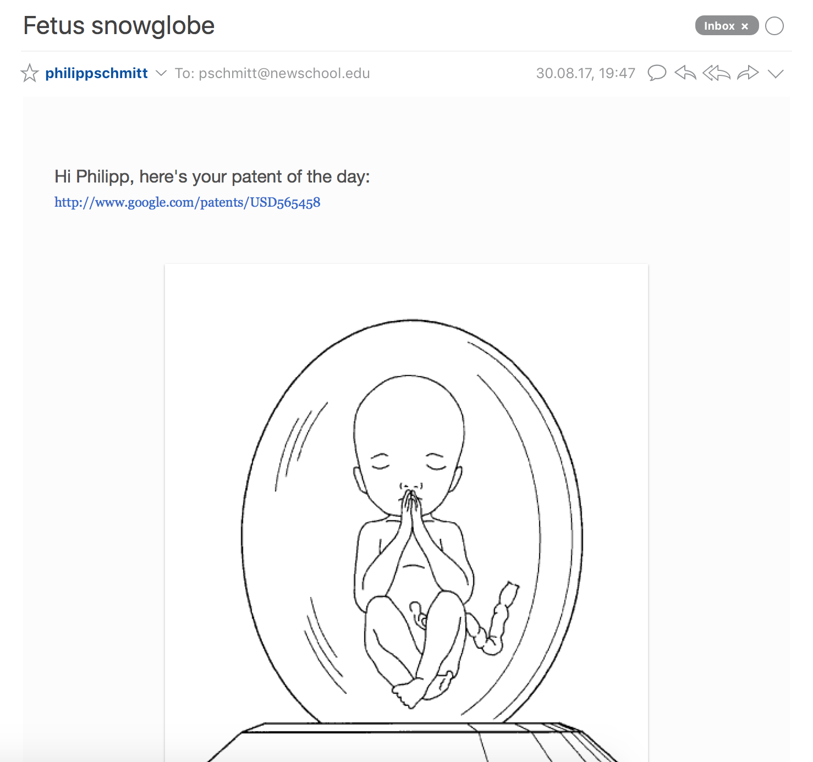
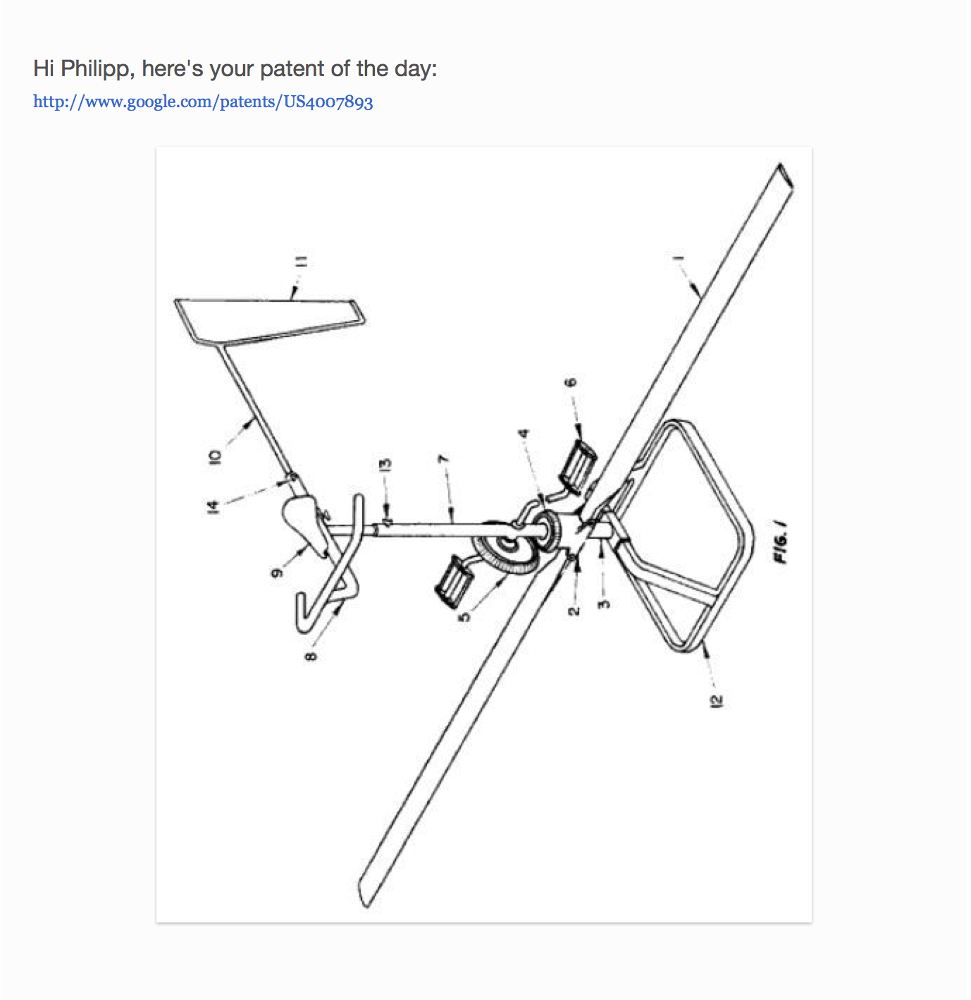
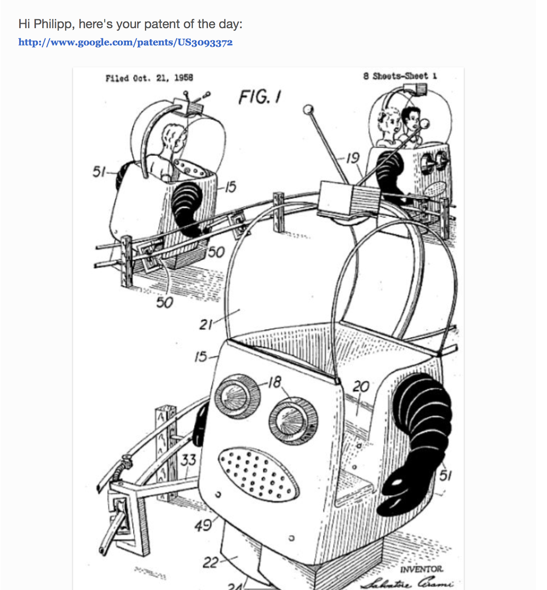
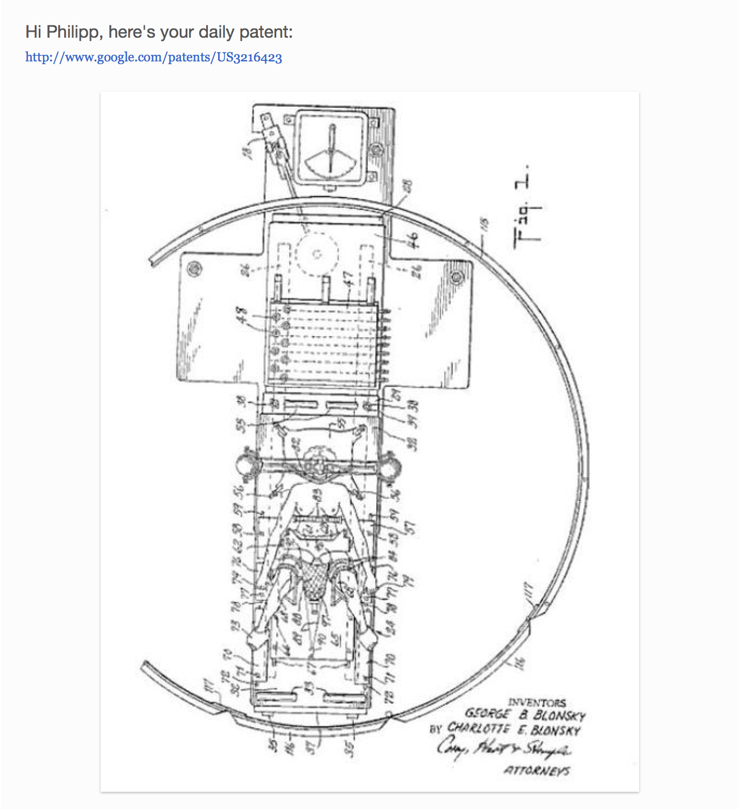

# 8/30: Daily Patent
In what I'd call my existing artistic practice, I am generally interested in the social and political ramifications of technology and design. Especially upcoming technologies provide inspiration for projects. To increase my exposure to these inspirations, I wanted to create an automated newsletter that sends me one interesting patent a day.  

Google used to have a Patents API, but has deprecated the endpoint in 2011. So I tried scraping patents from Google Patents using a simple Python script: 

```python
# import libraries
from lxml import html
import requests

# search for patents
page = requests.get('https://patents.google.com/?q=AI&scholar')
tree = html.fromstring(page.content)

# join all the HTML to a single string
text = tree.xpath("//text()")
text = ' '.join(str(x) for x in text)

# apply a regular expression to filter for patent URLs
regexpNS = "http://exslt.org/regular-expressions"
find = tree.xpath("//*[re:test(., '\/patent\/.*\/en', 'i')]", namespaces={'re':regexpNS})

# show the results
print(find(text)[0].text)
```
I am not a Python expert just yet, but am under the impression that Google has built into their page some measures to hide some of the HTML from robots like my scraper. At least the HTML my script returns does not include the list of patents from the website.  

Since I didn't want to put in more time troubleshooting into what would just be a first step of the project, I decided to prototype it manually. I selected a few intriguing patents from a Tumblr blog called [googlepatents](http://googlepatents.tumblr.com) and set up a [TinyLetter](http://tinyletter.com) newsletter to send me an email with a patent once a day.

I kept the emails pretty basic, only including the name, url and patent illustration. Here's how they look like:

#### Fetus Snowglobe #USD565458


#### Homocopter #US4007893


#### Robot amusement ride #US3093372


#### Apparatus for facilitating the birth of a child by centrifugal #US3216423


If I had more time to complete this project, I'd try to automate the patent scraping, mail setup and delivery. Another step could be to randomize the query, for example by taking a query term from the news, a random list of verbs or the previous day's patent.