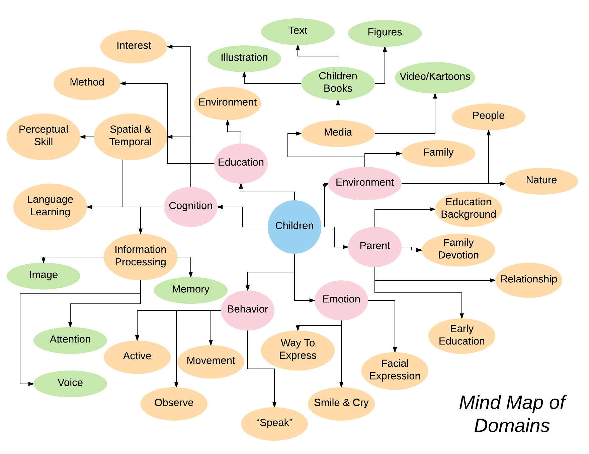

# :books:Touchable Books for Kids:hand:

## My Thematic Focus
I pick the concept of Day2 from my *"5-in-5 Assignment"* as my focus in this "Ideas in Form" practice.

In my Day2 Project, I got an inspiration from the washing sponges in my kitchen. As I touch it, the different feelings the two sides give me let me think about other associated words, like:

###### "Hard and Rough": "Difficult", "Dislike", "Negative", "Harmful", "Dangerous"...

###### "Soft and Fine": "Easy", "Like", "Positive", "Healthy", "Safe"...

Then a question came to my mind:

#### :question:Besides using colors to give a visual impact during the formation of our cognition, what if we can also touch to learn new things :question:

In this case, I developed an interest in studying the relationship between our senses and cognition.

## My Story
Based on my preliminary idea in Day2, I tried to design "A Touchable Book" introducing different animals to kids (Age 3-6).

I use a story to describe how I find it problematic in our daily lives:

*Jane is the mother of a four-year-old baby girl. She and her husband both attach a great importance to their daughter's early education. So they spend a lot on all kinds of children books and read them to their daughter everyday. Although most of these books are illustrated with vivid pictures, Jane find that it could still be difficult to keep child's attention for more than 10 minutes. Besides, it could also be a challenge for Jane to keep her daughter sitting down quietly, as she prefers to move around and touch everything she sees.*

## Mind Map of Domains

## Central Domains

## WHY?

## Communities of Practice
