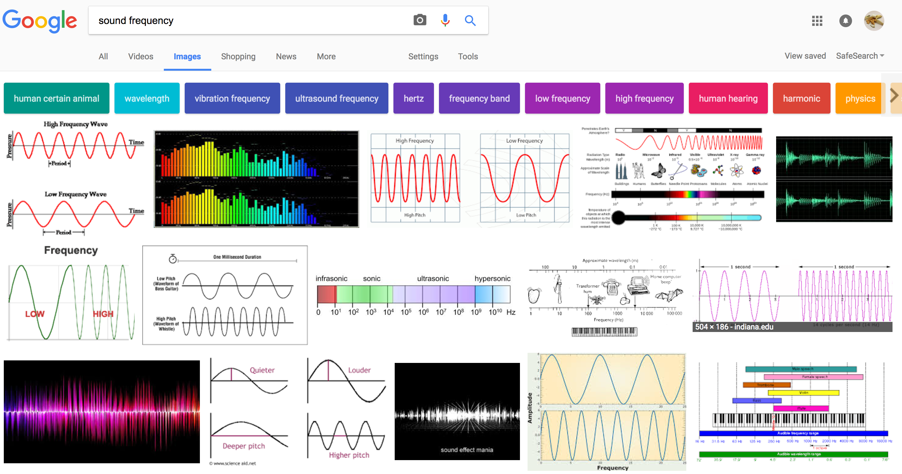
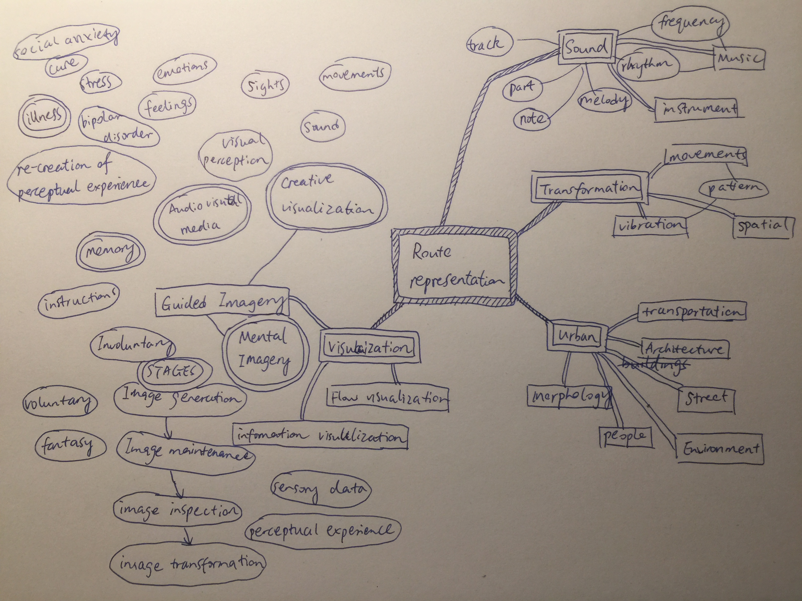
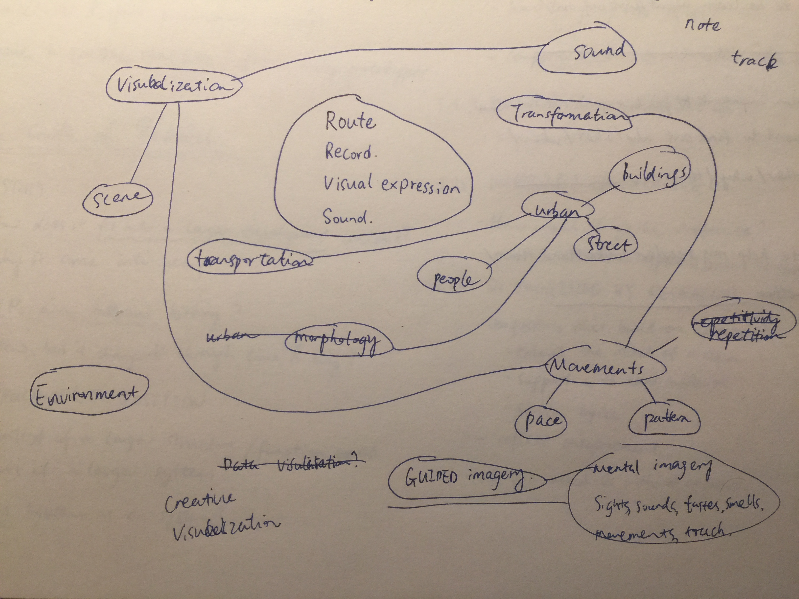
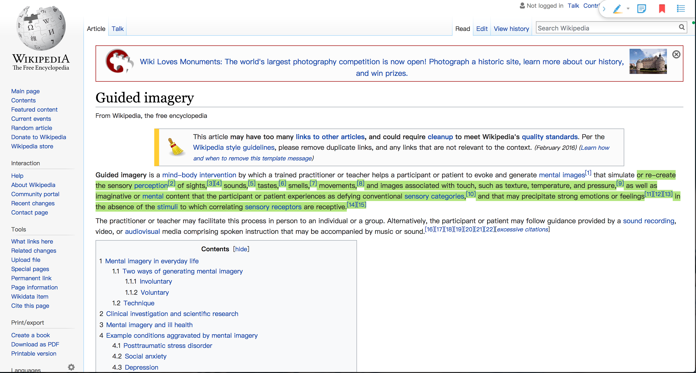

# 1D Story
## How to depict a route using method other than video recording?

This project I used a pen and paper to draw out a ‘frequency’ of a route, which stands for the vibrations and movements of myself. These vibrations and movements were caused by many factors such as my pace, the road itself, the transportation I used, and obstacles on the route.

The sound track now is just a long, single note according to the wave I drew, with accompany of drum beats as background (to make it less boring). But this is not enough for people to visualize the journey I took in their mind. It is not inspiring enough by just listening to this sound track. 

This many due to that many elements that affected the wave I drew have not been given credit. For example, the subway may think that ‘I do not sound like this, this is too steady and I was really fast!’; or the puddle may feel like ‘I’m too high-pitched, I prefer lower profile than this’; or the pavement may think ‘I was all like up and down and you showed nothing about such topography’; etc.. Furthermore, a single line of note is to some extends, hard for others to imagine things if without explanations. Adding parallel notes at some key points could be better and more helpful.

What I've written above does not look like a story..so I wrote another one as below.
This story regarded the shape of the note/frequency/wave as something with mind, his thought represent my progress of thinking as well.

## The Shape

### Thoughts
I am a single wave. 
/n But I represent a whole route.
There are many things happened on the route.
But I am a single wave.
How do I show those things?

### Wonder - What am I?

Am I a frequency?



Yeah I guess kind of? 
Not sure what an actual frequency should be like.
I guess I just need a little bit more modification.

Am I a wave?



Well.. I’m pretty sure there should be more kinds of waves than the ocean one.
But do I look like wave in the ocean..?
Yeah if you look at the ocean horizontally rather than in a section view.



Cool see here!
I do look like waves… some how..

Any other things that I’m similar to?
I’ve got peaks.. many mountains?



Yep, we are similar. To some extends.




Peak shape…
You know what..



Emm. Anyway.

### Thoughts
I’m just a single wave.
Wait.. I think I have a brother or something?
The drum beats?
Ok he’s like so low profile.
But backgrounds are kind of all like that.
He could be helpful, for enriching the whole thing.
He can change the rhythm.
Manipulate him can make a bigger effect I think.

### Conclusion
The goal of me and my brother to inspire people imagine the whole route,
is a bit hard.
Heeeeeeeelp!

## Mind map & Domain research

I create a mind map like this:


After organization and some research, I drew a mind map like this:


Through the research I found a very interesting domain - Guided imagery, which is under the domain of Visualization.
It is defined as:


I think this matches what I want to do, which is to enable people to imagine the route I took when looking and listening to my project. 
Yet the further I explore this domain, the deeper it seems to be. It is applied on treat of disease like social anxiety and bipolar disorder.
I did not expect this but I will keep this in mind. It is a possibility of where my project can go. And it is meaningful.

