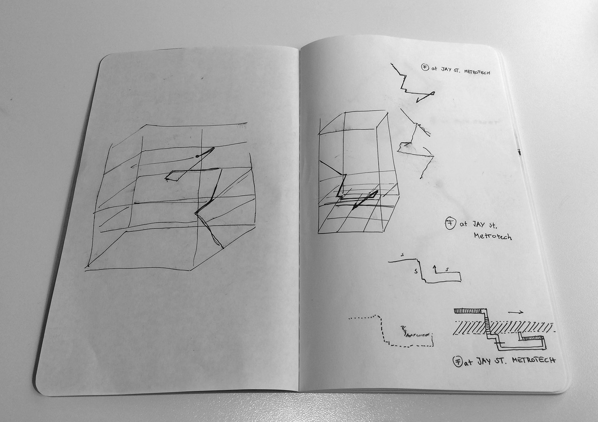
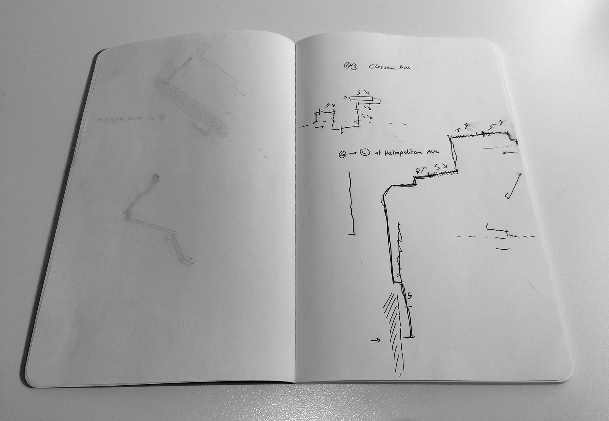
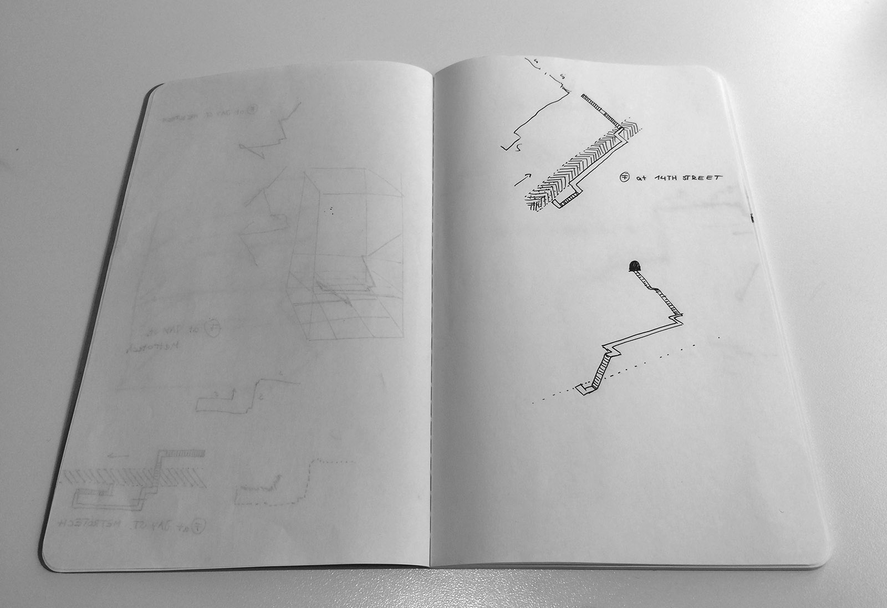
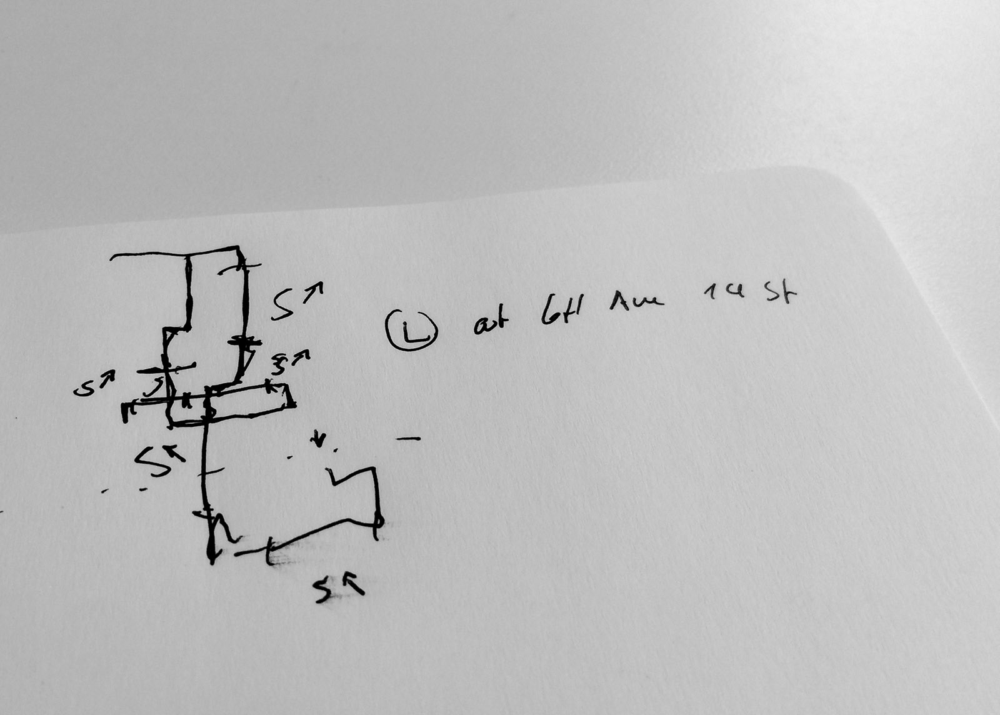

# 8/31: Mental Maps
Another way to discover new ideas could be to be more mindful of my surroundings. Commuting daily from Brooklyn to Manhattan, I find the infrastructure fascinating that allows people to move through the city at high speeds, underground.  
When you're using the subway you enter a hole in the ground at one place (sweat on the platform, then freeze on the train) and you pop out at another location, detached from a sense of the distance travelled and the neighborhoods passed underneath. The subway somehow compresses the space between platforms and stations.

For this 5-in-5 project, I tried to be more mindful and aware of the subway station's layout on my way to the platform. The idea was that paying attention to the architecture could lead to interesting questions about why things are the way they are.

While walking through the station, I recorded on paper the turns and staircases I passed through. Here are these initial sketches:

These drawings resemble maps and use some of the familiar formal elements from maps, but are drawn from memory and by no means accurate. If a line is longer I perceived the distance to be longer than where I drew a shorter line. This is likely generally true, but might sometimes be inaccurate or entirely wrong. These drawings are mental maps. 

I tried briefly to turn my drawings into 3D, but then decided to leave it at 2D and introduce symbols for staircases, the train tracks and directions as well as points of entry and exit.

To emphasize the abstraction of space between stations that I mentioned earlier, I joined together the maps from entry and exit stations. Here are the final, scanned results:

#### CLASSON AVE via METROPOLITAN to 6TH AVE / 14ST

#### JAY ST / METROTECH to 6TH AVE / 14ST

If I had more time it could be interesting to improve the visual language of the drawings. One idea is to digitize them and create a reminiscence of architectural blueprints. 