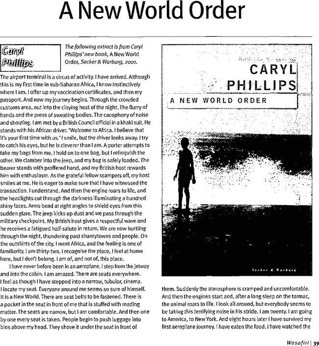

# 9/1: Pic to Paper
Today, I wanted to come up with a ruleset to point me in unexpected directions. I liked the idea of introducing randomness through computation. Having previously worked with Microsoft Azure's Computer Vision service, their image caption API came to mind because of it's flaws (and general clumsiness when tasked with input more complex than the usual training images).

I decided on the following process:

### 1. Select Input Image
I chose an input image from [a front-page article](https://www.nytimes.com/2017/09/01/us/houston-evacuees-hurricane-home.html) of The New York Times, Wall Street Journal, WIRED, or MIT Technology Review.

### 2. Image Captioning
I used [Microsoft Cognitive Services Computer Vision API](https://azure.microsoft.com/en-us/services/cognitive-services/computer-vision/) to generate captions for each photo. For the example picture from the New York Times, the result was *‘a man in a black suitcase'*

The caption is obviously wrong in describing the content of the image and completely fails to grasp the context of the photo (Hurricane Harvey). However, looking at the photo one can see how the conclusion was made and can acknowledge that the caption is not entirely off.

### 3. Search Academic Literature
I used the caption as a search phrase in Google Scholar and selected the first publication from the results page. For *‘a man in a black suitcase'* the result was the following:

Here is another example of the input image (from a [MIT Technology Review article](https://www.technologyreview.com/s/608468/a-different-story-from-the-middle-east-entrepreneurs-building-an-arab-tech-economy/)) and the output: 

Again, it would be interesting to automate the whole process. But again I felt like creating a proof-of-concept prototype is time better spent than dealing with all the coding problems that would arise for web scraping, dealing with the Azure and Google Scholar APIs, etc.