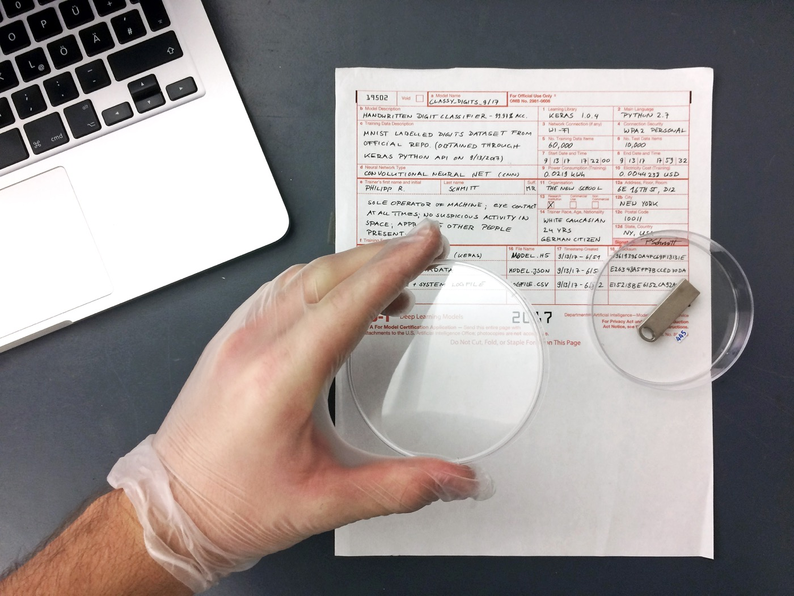

# 3D: Tangibles

Building on my [2D project](2D.md), I envisioned a scene at the fictional *Department of Artificial Intelligence Model Certification Service*. This office evaluates new machine learning models and hands out certificates for quality-controlled models.

Evaluation can mean many things. My vision is that this laboratory pays special attention to ethnographic issues with the goal of reducing any kind of bias in models that make it into production use.

To illustrate this concept I copied the model I created earlier on a USB drive which I placed in a petri dish. This gives a pseudo-physical form to an otherwise only digital *thing*. The petri dish evokes connotations of a virus or bacteria that needs to be handled carefully and examined critically, up close.

Here is the final image:

