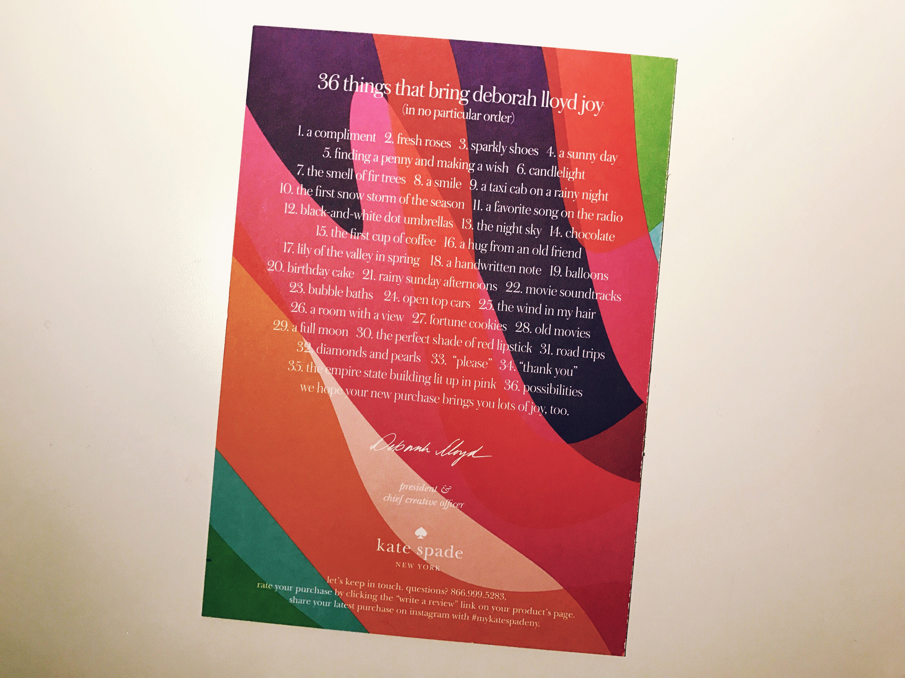
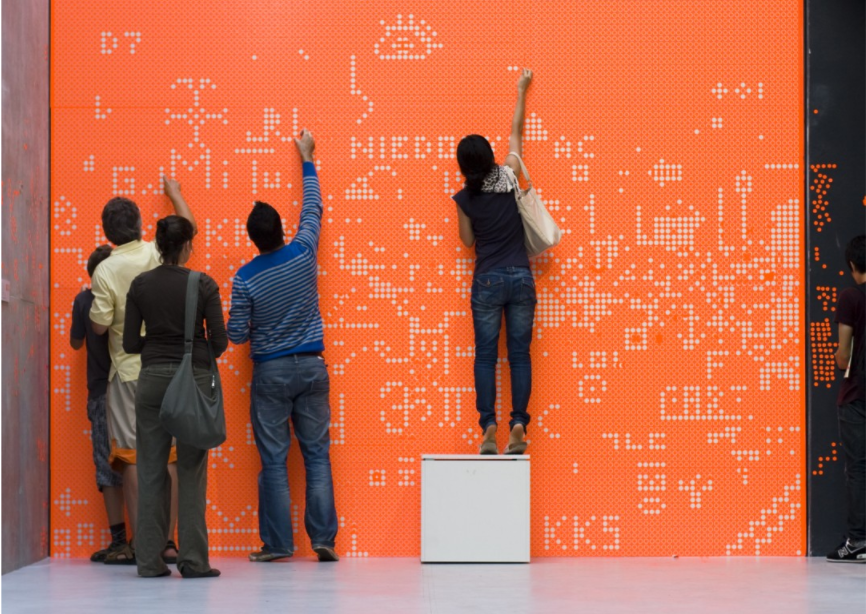
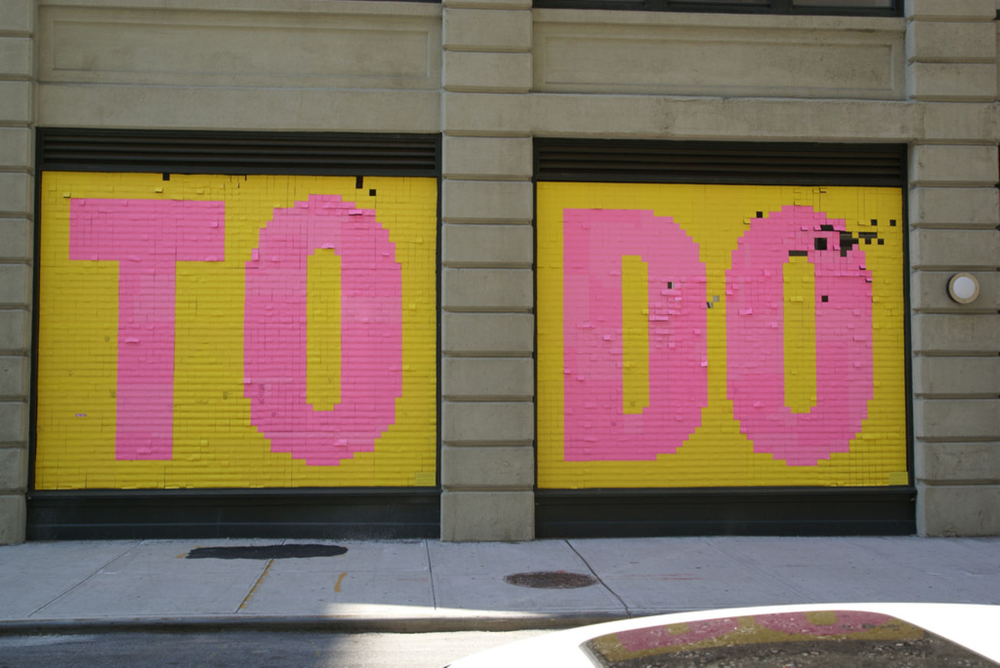
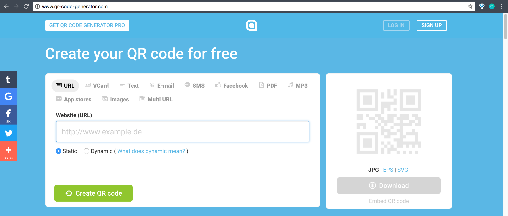
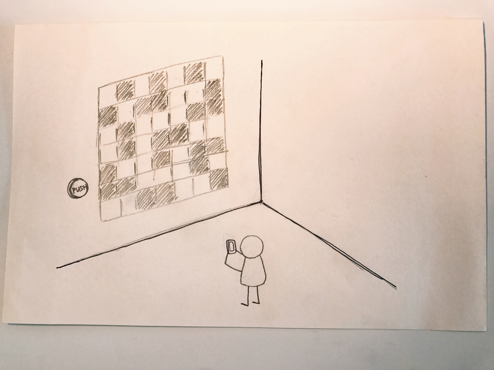
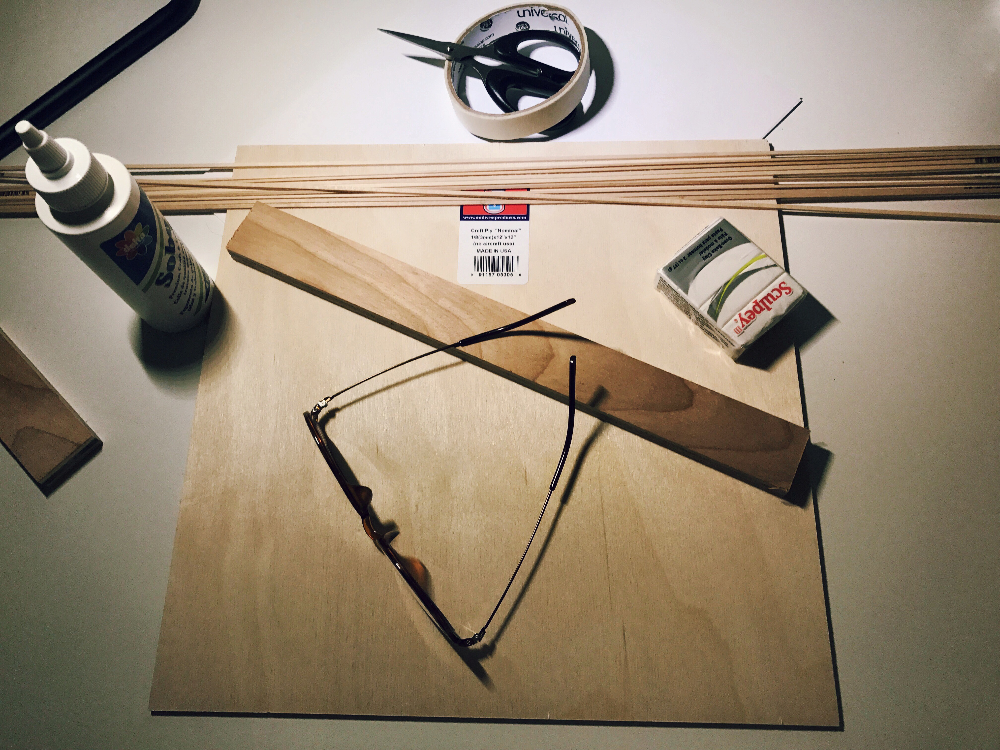
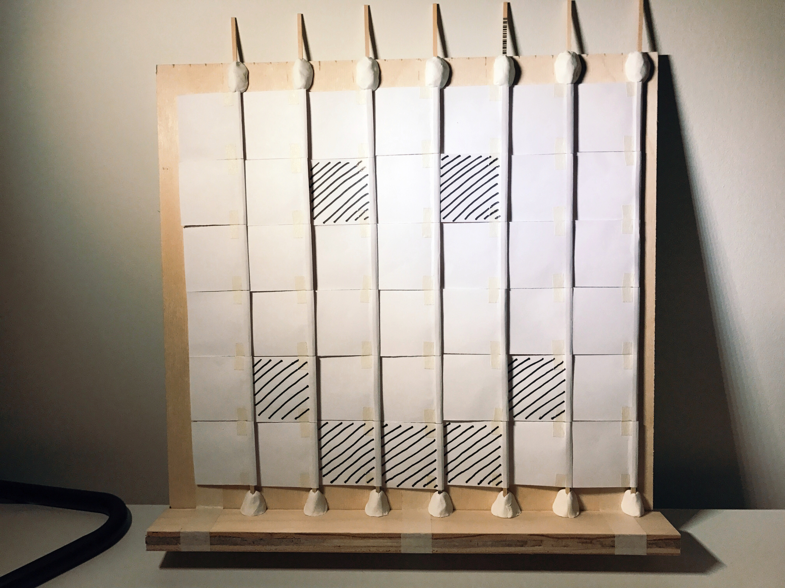
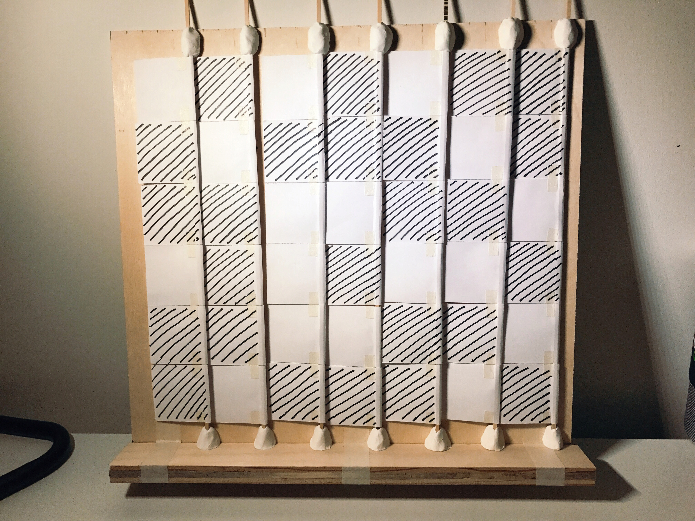

# 4D

:point_right: [Click here to see the slides](https://swipe.to/3380dx)

## Inspiration :bulb:

I was inspired from the card I got when I was receiving the package from *Katespade*, it was "36 Things That Bring Deborah Lloyd Joy". I found this card cute and interesting as I could really relate to those litte moment they list. I thought about 3 points here:

#### :pushpin:Moment

#### :pushpin:Random

#### :pushpin:Share

## Public Installtion :walking:

#### Project:one:

#### Project:two:

## QR Code :space_invader:

## Happy² :v:

An interactive wall shares "Happy Hours" by randomly generating QR Code created by others.

