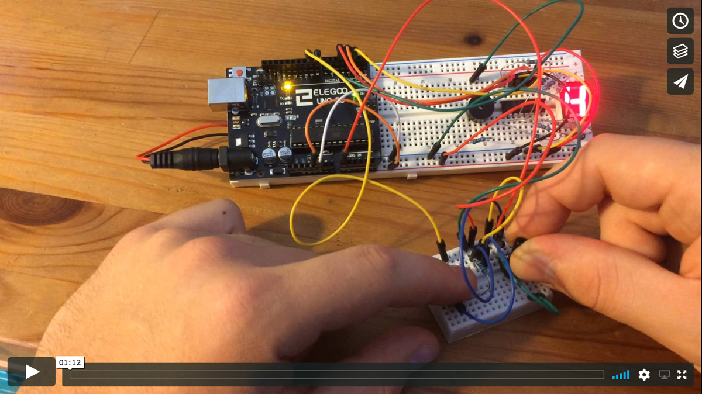

# 4D: Time

I started this project with the following questions: How does it feel to become an artificial intelligence? And how can I create an experience that helps understand what it means to create an artificial intelligence?

Creating neural networks that perform specialized AI tasks requires essentially two steps: training the network and testing its accuracy.  
In order to create a project that allows to experience both aspects I built a prototype of a handheld AI trainer device using Arduino.

This device shows numbers on a 7-segment-display (as a reference to MNIST, the foundational machine learning dataset) and simultaneously plays a note. Each number is associated with a unique tone frequency.  

By clicking a button the user can hear random numbers and memorize the corresponding sound. As with machine learning, how the information (sound-tone relation) is understood and memorized is not defined by the training environment, but happens in the user's head and is not clearly explicable. 

A long-press on the button switches the device to test mode. Now the user hears a random sound and has to use the potentiometer to dial the display to the corresponding number. Clicking the button checks if the guess is correct and displays *C* for correct and *F* for false.

Counting and averaging the correct and wrong guesses allows to calculate an accuracy value of the user's sound-number-classifier neural network. This is the defining metric for if the neural network is useful or not. Generally, accuracy should be in the high 90% range. Keep training!

