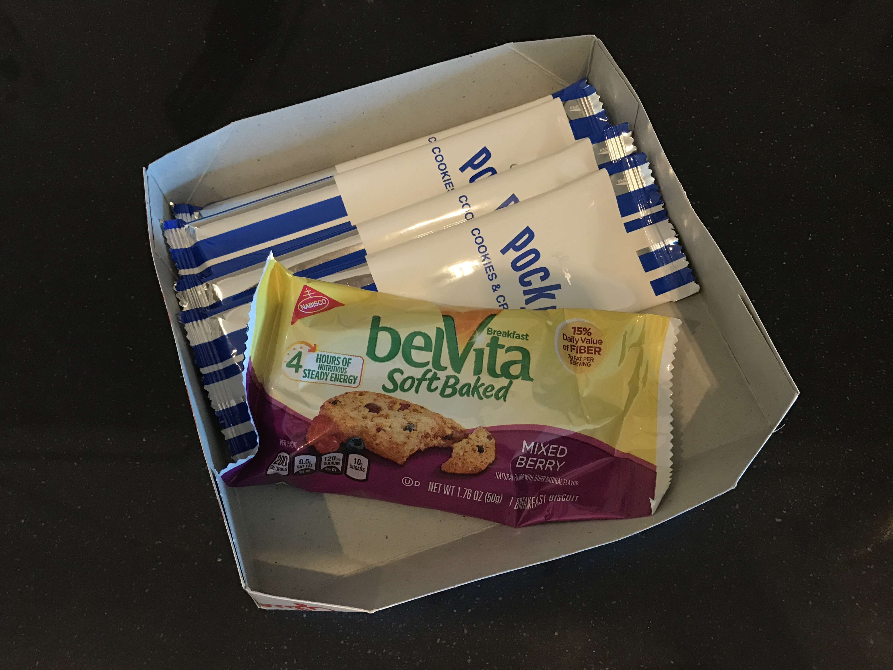

# DAY 3

#### Object: Snacks:chocolate_bar:

#### Sense: Taste:tongue:

#### Medium: Drawing & Interview:art:

## Idea

Everyday morning before leaving home, I need to make sure that I haven't forgotten anything necessary. In addition to my phone, my keys, my purse, my computer... there is one thing I'll feel uneasy without it: SNACKS!

No matter they are chocolate bars or biscuits or candies, I need snacks to recharge myself, physically as well as spiritually.

Something interesting is that the sense of taste is always related to one's memory. And memory is something that can not be wipen easily.

In this case, I was curious about our memory of food based on our sense of taste:

### :question:Could our preference for taste be changed:question:
### :question:How powerful could this "Taste Memory" be:question:

## Solution

I interviewed several people in DT and ask them to draw their favorite snacks/food/drinks in their childhood.

It appeared that even if some people could not remember clearly what the package of the snacks looks like, they still remember the taste and also some interesting stories behind. And most of them told me that they wanted to eat the snacks when they were drawing.:joy:

