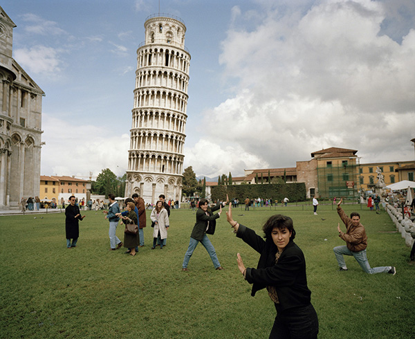
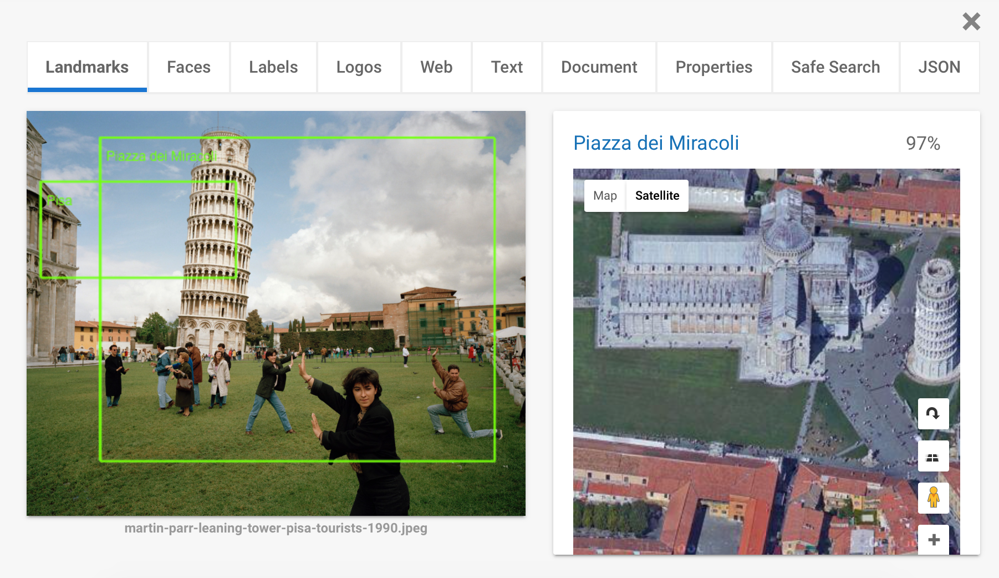
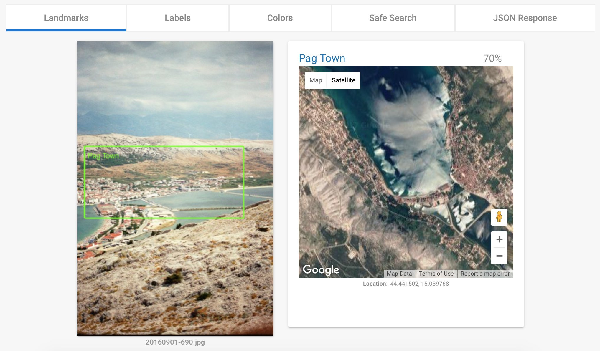
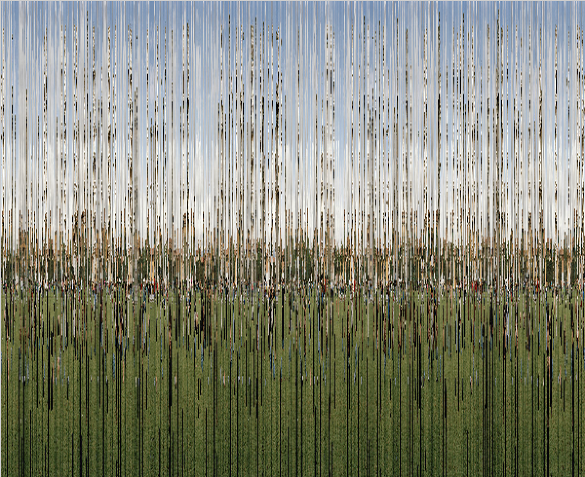

# 9/2: Cryptography

Today's project is a reversed take on a series about ‘getting new ideas’. Basically my mind wandered from the concept of *preventing others to get any ideas* to cryptography.


*Martin Parr
ITALY. Pisa. The Leaning Tower of Pisa. From 'Small World'. 1990.
*

We're sharing big amounts of data with companies like Facebook. They provide a useful, free service but at the same time monetize our personal information. With evolving computer vision and AI technology, even from images they can extract meta information like faces, locations, and much more.  
A quick test with Gooogle's Cloud Vision API demonstrates the information that can easily be detected from a picture. 



I used [an iconic photo by British photographer Martin Parr](
Martin Parr
ITALY. Pisa. The Leaning Tower of Pisa. From 'Small World'. 1990.). However, the algorithms can identify much more subtle landscapes as I demonstrate in the following example:



I wanted to build a browser extension that encrypts images (like your family holiday photos on Facebook) for the middle man and decrypts them again for another person who has a private decryption key. The advantage of encrypting directly in an image format would be that one could keep using Facebook as usual, but would keep the company from using your photos for their purposes.

To keep the workload manageable I gave up on the extension idea and built a simple proof-of-concept for a visual cryptography method. A Processing script slices an input photo into 1px wide pieces and rearranges the pieces randomly on the X axis.  



The result is an obfuscated graphic that does not allow for seeing its content. However, using a decryption key (that has to be shared privately between image provider and audience) the image can be decrypted to the original image.  

This is the decryption key for the image above:

```
	$:271:469:253:336:575:287:405:346:470:289:488:21:285:335:48:117:147:84:431:498:522:455:554:418:563:521:24:530:495:284:448:190:588:321:508:109:572:379:49:98:340:135:597:358:266:458:215:99:429:386:471:371:374:348:116:526:543:50:345:343:486:528:226:537:162:265:237:103:360:560:127:152:291:453:582:235:188:247:502:53:584:427:454:512:468:201:476:395:1:437:142:45:500:118:249:219:198:61:573:555:34:385:110:203:593:432:483:518:561:369:251:246:57:132:590:270:311:228:394:105:426:169:415:506:300:347:485:596:296:138:234:69:255:257:36:170:515:26:570:22:366:540:421:295:120:402:166:172:158:373:256:489:280:60:51:65:58:535:35:353:244:144:450:581:275:315:32:180:218:149:586:88:398:406:383:17:452:337:547:352:107:435:95:294:40:83:447:239:460:461:183:11:223:177:113:484:134:463:598:301:342:341:364:327:356:306:308:510:283:106:446:293:546:187:292:527:333:77:433:599:319:396:477:37:137:531:231:39:553:351:47:101:91:558:4:404:273:28:163:355:73:216:434:556:497:27:238:551:19:176:126:382:55:574:545:368:13:243:220:380:128:6:365:408:160:154:263:384:31:10:191:538:115:86:225:184:307:594:230:310:314:194:18:20:248:324:441:268:108:100:320:30:472:322:449:491:303:583:464:157:171:141:566:410:577:211:279:490:439:564:153:185:519:317:481:155:168:350:131:326:388:550:445:29:565:164:304:440:192:197:313:59:534:517:232:487:443:390:242:457:112:261:376:146:328:130:334:139:76:150:281:80:494:92:325:422:516:375:70:579:229:123:533:493:305:125:430:208:129:549:505:136:5:90:178:438:236:456:43:66:52:23:509:151:259:97:409:329:9:391:79:288:221:524:514:63:62:199:302:363:140:503:589:41:541:56:7:523:175:414:181:465:195:466:299:210:16:548:156:403:207:479:428:290:507:361:467:392:64:377:416:569:78:568:264:459:254:286:496:513:67:595:587:504:111:179:501:492:14:2:269:133:93:413:148:367:442:205:323:278:89:186:332:473:217:82:357:165:262:387:298:241:482:362:3:104:38:145:451:209:480:562:354:245:525:206:119:532:46:567:173:72:204:277:425:182:444:378:423:12:252:417:297:96:420:42:578:539:200:8:0:511:143:15:212:393:189:412:167:224:159:124:276:585:544:122:33:399:227:407:44:85:338:267:475:576:339:542:174:102:529:193:222:462:559:419:75:54:580:68:536:372:202:214:25:474:571:436:81:161:400:401:344:381:389:312:282:331:213:240:74:552:318:349:359:94:87:370:520:316:274:71:260:114:557:309:397:424:478:330:499:233:411:250:121:592:258:196:272:591
```

This is a very crude algorithm to demonstrate the concept. A far more advanced encryption algorithm would be necessary to achieve a higher level of security.

Building this concept into a browser extension would be especially intriguing because the user would never actively engage in the encryption and decryption process and would just enjoy Facebook et al. as she is used to.

It would be interesting to further explore the feasibility of a system like this. If feasible, new questions arise: If this system gained widespread adoption, how would Facebook react to being excluded from the content shared on their platform? Would it harm the company economically? Would they care at all?

This is the code to produce and display an encrypted image:

```Processing

import java.util.Collections;

PImage input;
int cellWidth = 1;
int imgWidth = 600;
int imgHeight = 490;

ArrayList<PGraphics> cells = new ArrayList();
ArrayList<PGraphics> encrypted = new ArrayList();

void setup() {
	size(620, 620);
	input = loadImage("in.jpeg");
	// draw src
	// image(input, 10, 10, imgWidth, imgHeight);
	// create key array that determines shuffling later
	ArrayList<Integer> keys = new ArrayList();
	for (int i = 0; i < imgWidth/cellWidth; ++i) {
		keys.add(i);
	}
	// reorder cells list randomly and save order as a key
	// (this will become the secret decryption key)
	Collections.shuffle(keys);
	// join indexes to create one key string
	String key = "$";
	for (int i = 0; i < keys.size(); ++i) {
		String t = keys.get(i).toString();
		key = key + ":" + t;
	}
	// print private key to be shared between sender/receiver
	println(key);
	// load source into array
	for (int i = 0; i < imgWidth/cellWidth; ++i) {
		// load cell into buffer object
		PGraphics cell = createGraphics(cellWidth,imgHeight);
		cell.beginDraw();
			cell.background(255);
			cell.image(input,-i*cellWidth,0);
		cell.endDraw();
		cells.add(cell);
	}

	// build output image
	PGraphics output = createGraphics(imgWidth,imgHeight);
	output.beginDraw();
	output.background(255);
	for (int i = 0; i < keys.size(); ++i) {
		int pos = keys.get(i);
		output.image(cells.get(pos), i*cellWidth, 0);
	}
	output.endDraw();
	image(output, 10,10);
}

```