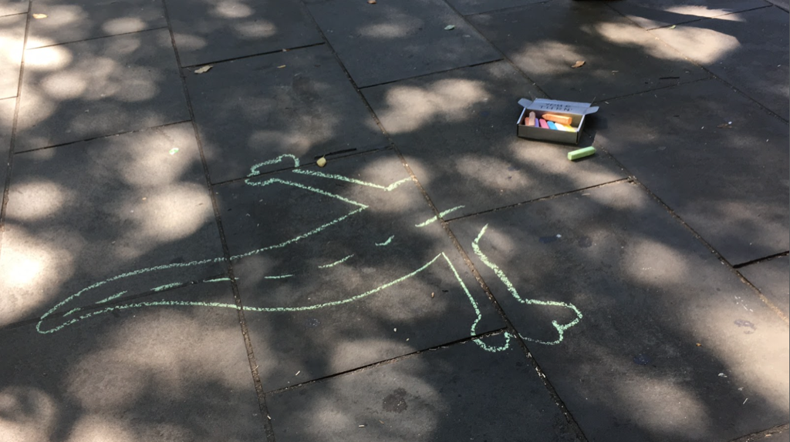
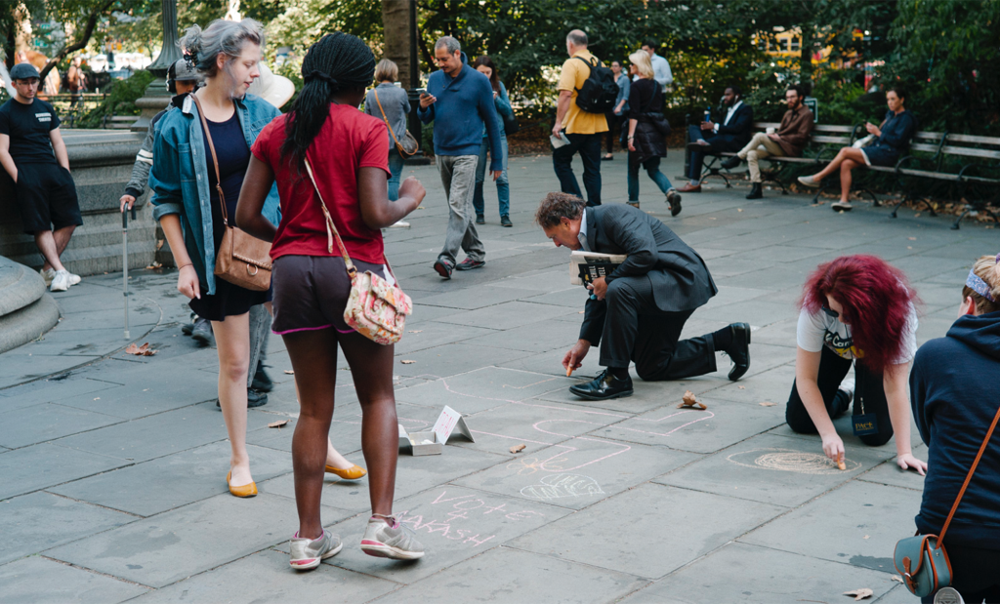
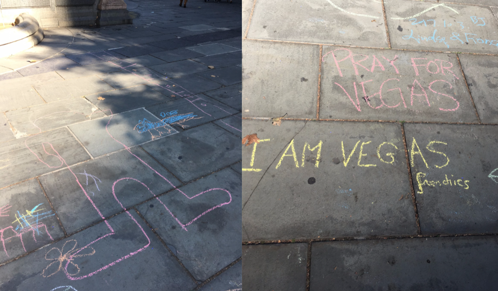
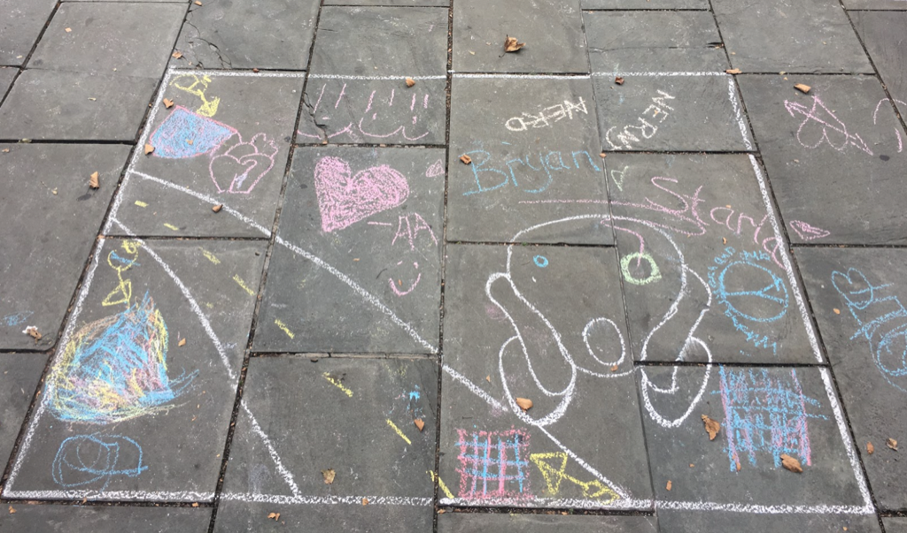
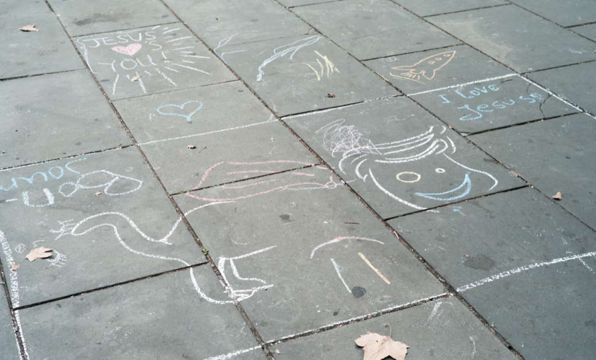
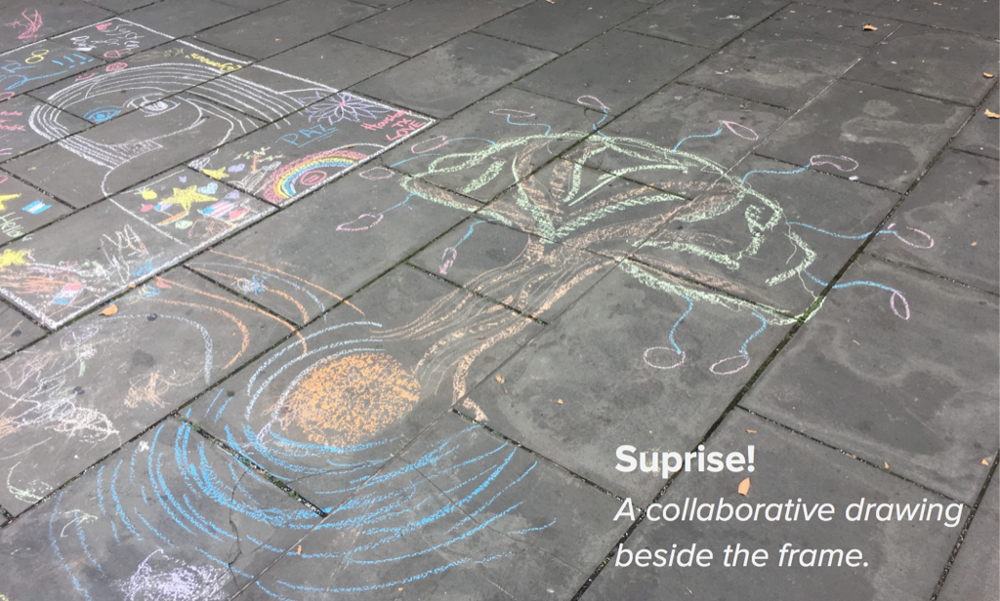

# 5D: Instruction Set for Strangers

This project explores collaborative chalk-drawing in public spaces. 

## Location
Iris and I chose City Hall Park in lower Manhattan as a site for our intervention.   
The park is frenquented by an interesting mix of people: There are the nearby office workers and City Hall employees on the one hand, and the tourists streaming in from the nearby Brooklyn Bridge on the other hand. Surrounded by skyscrapers and multi-lane roads, the park is a peaceful enclave running at a lower pace than the bustling city around it.

## Idea
Our idea for the project was to invite people to draw with chalk and create something together. This collaborative artwork would hopefully embrace the creativity of diversity. We were inspired by children's chalk drawings and chalk-based sidewalk games we knew from our childhood.

## First Prototype, Location B
We tested our first prototype on Tuesday, October 3rd between 12:30-2:30pm. The prototype consisted of chalk in a painted cardboard box with the instruction “Your Turn!” written on the lid.

To give an incentive to draw, we also traced a simple dino? reptile? ...? tail on the ground and placed the chalk next to it.

Unfortunately, people often only noticed the box at the last second before stepping on it. So we added a stand up sign with the instructions “Your Turn!” on one, and “Draw!” on the other side. This increased visibility and we soon had our first participants.

This is the final stage of the drawing after multiple people collaborated:

## First Prototype, Location A

We tested a second location with the same setup and got a much better response. This is likely because location A has much more people that are not just passing through, but conciously enjoying the park.

However, here people quickly abandoned out add-to-the-drawing concept and started writing messages, their Instagram-Username, and political messages.  

## Second Prototype

Chalk is a popular medium for activism in public spaces. While we're certainly not trying to prevent that, for this project we wanted people to create collaborative pictures, not activism.

We had different ideas how to encourage visual rather than textual drawings and ended up with what we thought the simplest experiment possible: Drawing a frame around the picture!

As [you can see in this video](https://drive.google.com/open?id=0B8bqWNW9iXvIYlJEM2dQcF9tU3M), this worked surprisingly well. For a long time, no one drew outside of the frame. Even kids played by the rules and the frame seemed to encourage writing with older people as well.  
Unfortunately though, as soon as someone did go outside the frame or wrote words, the spell was broken and other people followed the “bad example”.

Please also note the new sign we mad for this iteration. It was larger than the previous one and made with more attention to detail.

## Conclusions

While the frame prevented writing to some extent and fostered a more condensed picture, we also had the impression that it deterred some people from drawing alltogether. Maybe because they had higher expectations now about the necessary drawing skills.

Also, the 2nd prototype was tested on a weekend. This resulted in the audience being mostly tourists and families while we didn't see any of the business people we had encountered on the first visit.

Another interesting finding was how people from different cultural backgrounds react to assignment. In one instance, a Chinese boy after coming back to the drawing multiple times, pretended to pick up chalk, pretended to draw and then dropped his imaginary chalk back in the box.

Iris (who is Chinese) talked to them after and had an explanation that was surprising to me: where she's from in China, public art is not very common. In fact, if you would try to do our project in a public park there, you would probably be sent away by authorities. This can be an explanation for the boy's hesitation. It is interesting how he still instinctively knew what to do and started “air-drawing” instead of doing it for real.