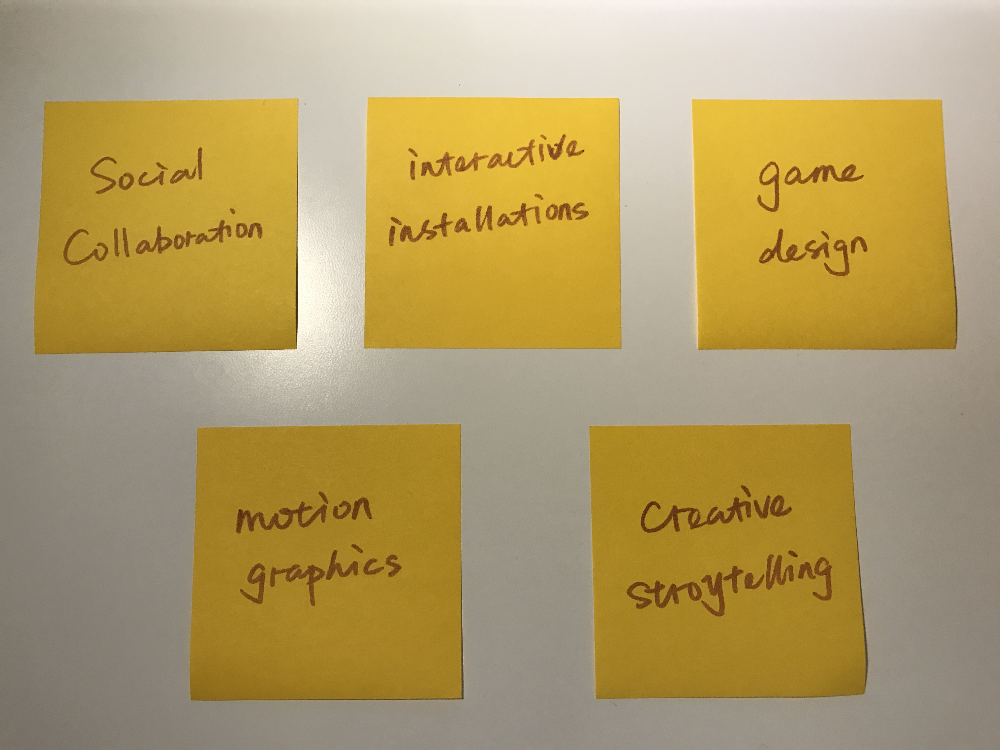

# Brainstorm around interest areas and research domains

It is an exercise aiming to exercise to identify both *reasonable* and *valuable* domains in which to locate research & making. Here are areas of interests I wrote down during the brainstorming in class:

## So what?

Chapter 3.4 in *"The Craft of Research"* force designers to rethink about their concpets, whether it is a question worth asking and exploring. Beyong just being curious, what is the significance of this question not only to you, but to people around you.

Then, I am followed the process outlined in Chapter 3.4.1-3.4.2:

#### Step 1: Name Your Topic

#### Step 2: Add An Indirect Question

#### Step 3: Answer "So What?"

---

#### Social Collaboration
1. I am studying the psychological motivations of social collaboration,

:point_right:because I want to find out what kinds of factors will lead people to cooperate with each other

:point_right:in order to incorporate these factors when designing some social collaboration-based systems.

#### Interactive Installations
2. I am trying to learn the secrets of success of some interactive installations,

:point_right:because I want to know about the functionality of those installations and mechanism of the interaction

:point_right:in order to make my installations more intuitive and useful.

#### Game Design
3. I am working on the characteristics of good game design,

:point_right:because I want to know how different factors perform in a game, like the background story, the rule, the characters etc.

:point_right:in order to use those techniques to make my game more engaging and interesting.

#### Motion Graphics
4. I am trying to know the criteria of an outstanding motion graphics work

:point_right:because I want to know the workflow when you are working on your project

:point_right:in order to do my work efficiently.

#### Creative Storystelling
5. I am doing research to find out the relationship between storytellers and listeners when it comes to interactive storytelling

:point_right:because I want to know what kind of influence the storytellers may exert on their listeners

:point_right:in order to let my listeners explore the story actively instead of just listening to the story passively.
