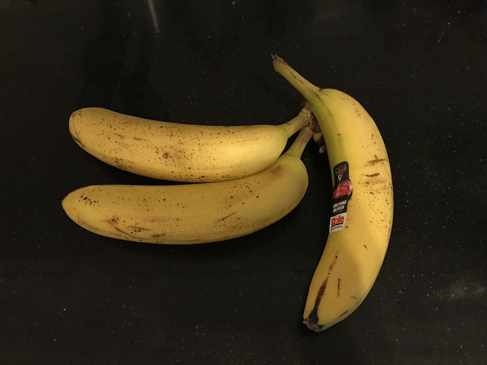
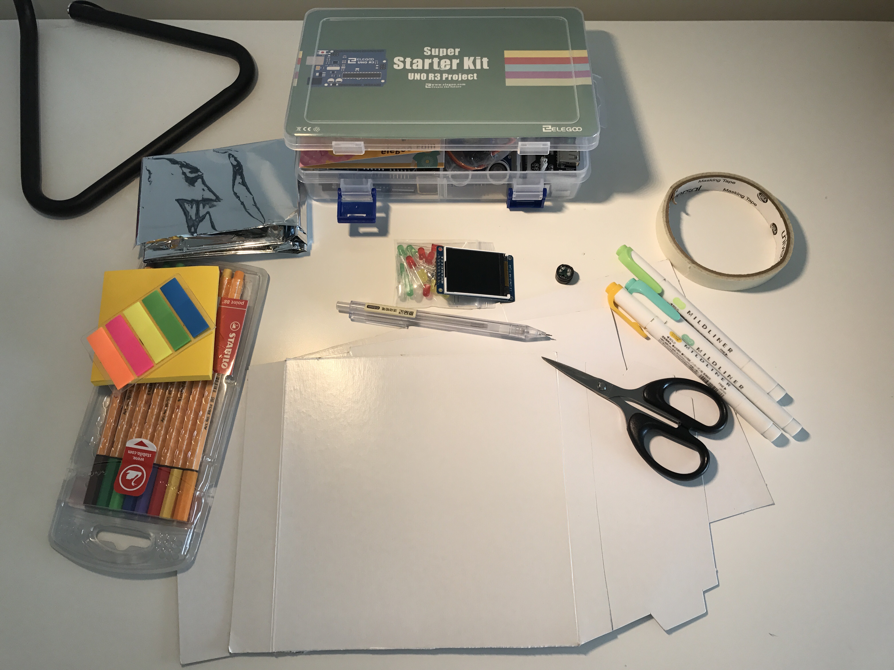
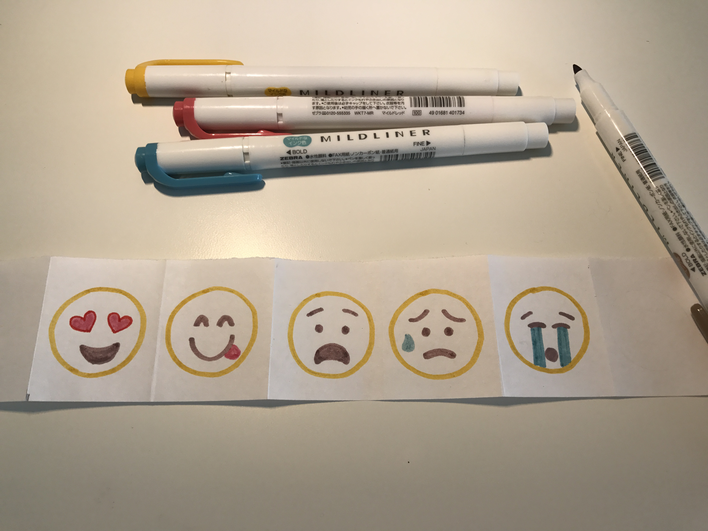

# DAY 1

#### Object: Bananas:banana:

#### Sense: Smell:nose:

#### Medium: Handcraft:straight_ruler:

## Idea

As a lazy person, I love bananas, because they are easy to peel. However, at the same time, they are also easy to go rotten. And when one of them go rotten, all of them will go rotten AS FAST AS THEY CAN!! I always don't remember to eat my bananas until one day they can not be eaten any longer.:cry:

Because bananas can not speak like people.:expressionless: They will not call you to eat them. So I was wondering:

### How can I make them "speak" to remind me to enjoy my everyday banana:question:

## Solution

According to my research on the Internet, I know that bananas produce a huge amount of *Ethylene Gas* as well as a series of volatile esters and alcohols that make up their aroma as they ripen. And the more *Ethylene Gas* they produce, the faster they go downhill.

Then I came up with the idea to design a :memo:*"Banana Reminder"*:memo: which uses a sensor to detect the concentration of *Ethylene Gas* in the atmosphere around bananas and connect that data to a *LED Screen* and *Voicebox*, which will remind you to eat your bananas in their best flavor and fragrance.

Also, I designed an interactive part. Whenever you eat a good banana, the number next to the "Happy Face" will plus one. Conversely, whenever you forget your banana, the number next to the "Sad Face" will plus one.

:point_up:Materials I used to create the prototype.:point_up:

:point_up:Sketches:point_up:

:point_up:In the front side: LED Screen, "Happy Face", "Sad Face".:point_up:

:point_up:I used a series of *Emoji Faces* to describe the progress as bananas ripen.:point_up:

