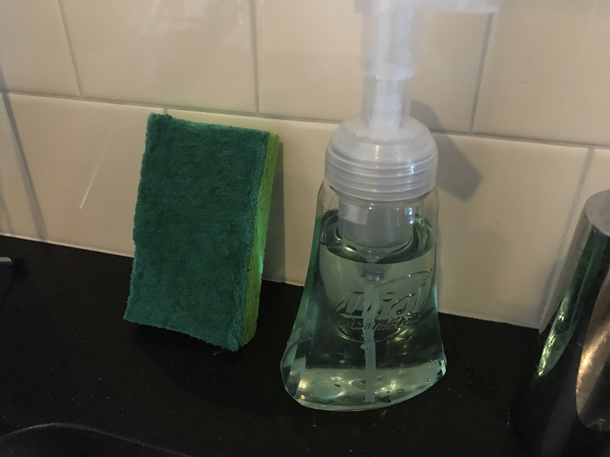
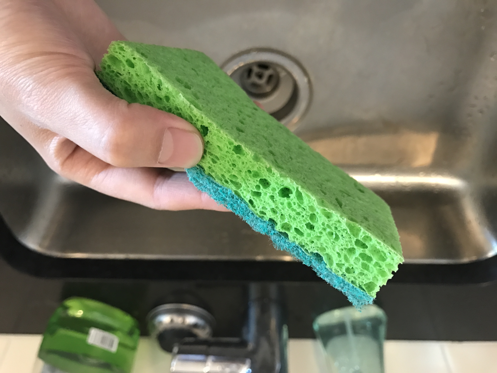

# DAY 2

#### Object: Kitchen Washing Sponges:ocean:

#### Sense: Touch:hand:

#### Medium: Photoshop:computer:

## Idea

One interesting thing I found about these washing sponges is that they have TWO sides: one side is hard and rough, another side is soft and fine. This dual-functionality facilitates our daily lives.

I tried to extend this duality by trying to associate it with words that give the same feeling when I touch the washing sponge:

### *"Hard and Rough"* is related to "Difficult", "Dislike", "Negative", "Harmful", "Dangerous"...

### *"Soft and Fine"*, conversely, is related to "Easy", "Like", "Positive", "Healthy", "Safe"...

## Solution
