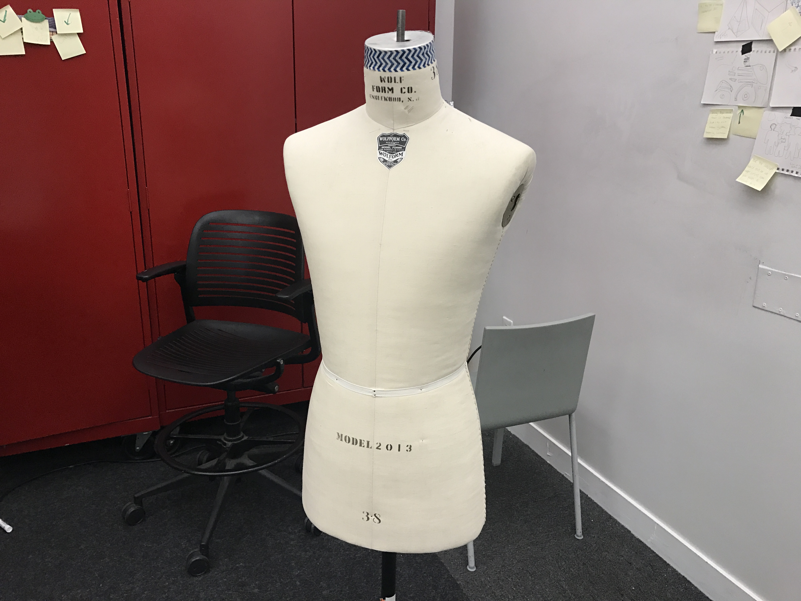

# DAY 4

#### Object: Plastic Shopping Bags:money_with_wings:

#### Sense: See:eyes:

#### Medium: Handmaking:scissors:

## Idea

One thing that surprise me when I first went shopping in NY is that shops here are really GENEROUS! The cashier will seperate your goods in :three: bags even if they CAN be hold in just :one: bag.

Gradually, those plastic shopping bags pile up in my cupboard. And the speed I recycle them as trash bags is always slower than the speed I get new ones.

### :question:So...maybe I could also make :recycle:*"A Trash Bags Dress"*:recycle: like those boring people on the Internet:question::sweat_smile:

## Solution

:point_up:I carried my trash bags and went to D12 on Saturday to make my dress!:point_up:

:point_up:Before starting, I draw some sketches to outline how the dress will look like.:point_up:

