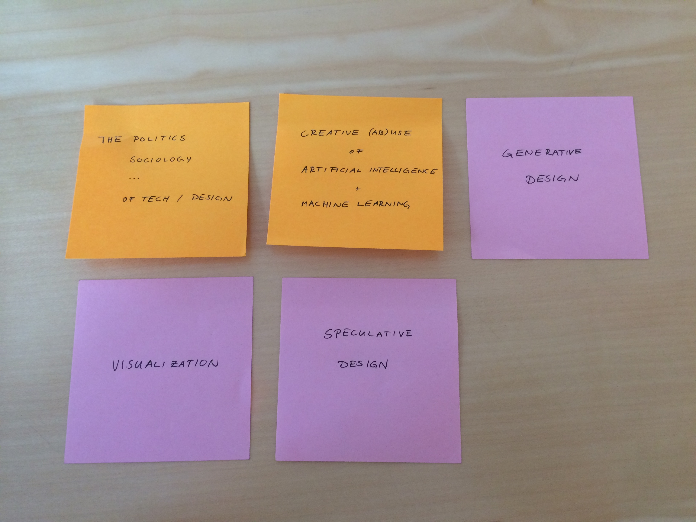

# Brainstorm around interest areas and research domains
[Project brief](https://docs.google.com/a/newschool.edu/document/d/1LD6-bFtYp8ZbregL_8YHhkHAm6EwyQelnKf2WNhC5zQ/edit?usp=sharing)

This is an exercise to identify good research questions. Here are the areas of research I wrote down during the brainstorming:

And once again:

1. The Politics, Sociology, Culture, ..., of Technology and Design
2. Creative (Ab)Use of Artificial Intelligence and Machine Learning
3. Generative Design
4. Visualization
5. Speculative Design

To get to more specific research questions, I am following the process outlined in “The Craft of Research”:

**Step 1. Name Your Topic**  
**Step 2. Add an Indirect Question**  
**Step 3. So what?**  

Here are the results for some of my areas of interest:

1. I am studying the political, sociological and cultural remifications of technology and design
	- because I want find out in which ways these areas are intertwined
		- in order to develop practices for designers and technologists to be aware of what their work will do in the world.

2. I am studying creative/poetic/artistic uses for AI and ML technology
	- because I want to find out what their possible applications are besides commercial use
		- in order to develop new tools for creatives to use in their practice.
		
3. I am studying possible applications for AI technology in generative/computational design
	- because I want to find out how the increasing availability of these technologies can advance the field and create new aesthetics and concepts beyond what is established in the discipline today
		- in order to develop new tools for creatives to use in their practice.

4. I am studying visualization of data, algorithms and other technological phenomena
	- because I want to find out about and communicate their inner workings, information and biases
		- in order to uncover ‘black boxes’ of technology that result in uninformed rejection or acceptance
	
5. I am studying speculative design as a method of using design as a method of inquiry into other domains
	- because I want to find out how design can be useful apart from commerce
	- because I want to develop alternative ideas for possible futures
		- in order to develop alternative ideas to the hackneyed commercial future scenarios presented to us by technology companies.
		- in order to evaluate possible applications and implications of upcoming technologies.

# Mindmap