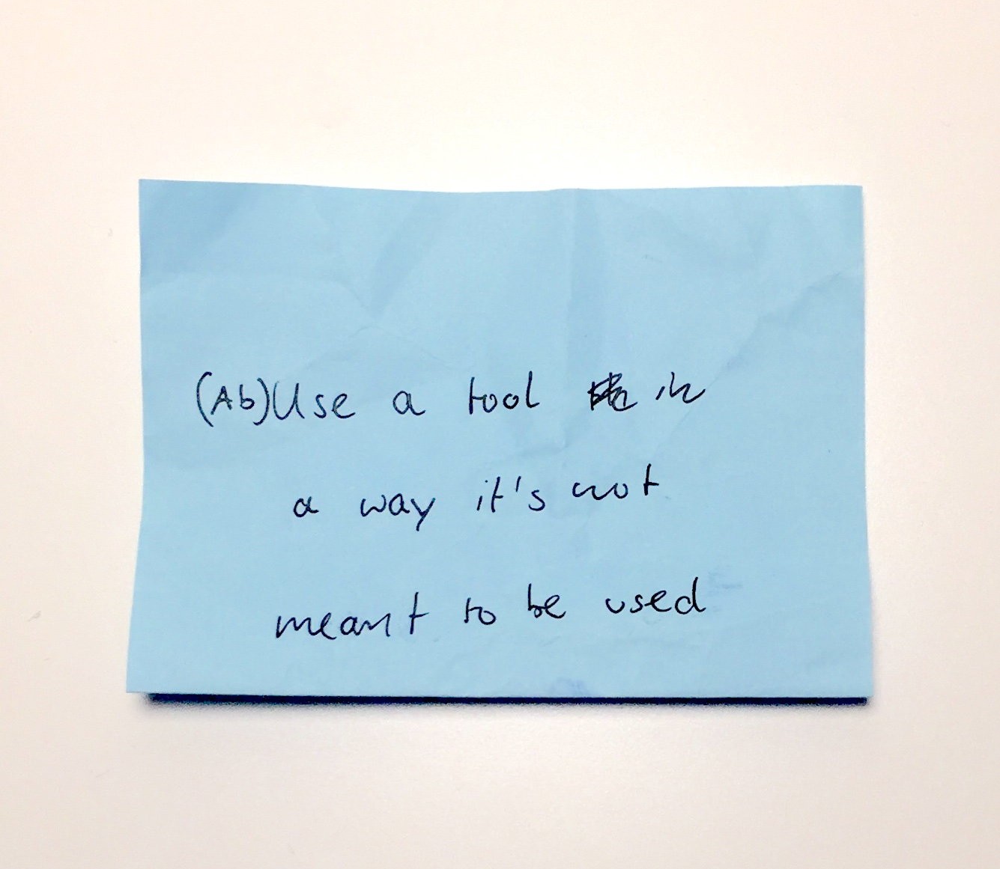
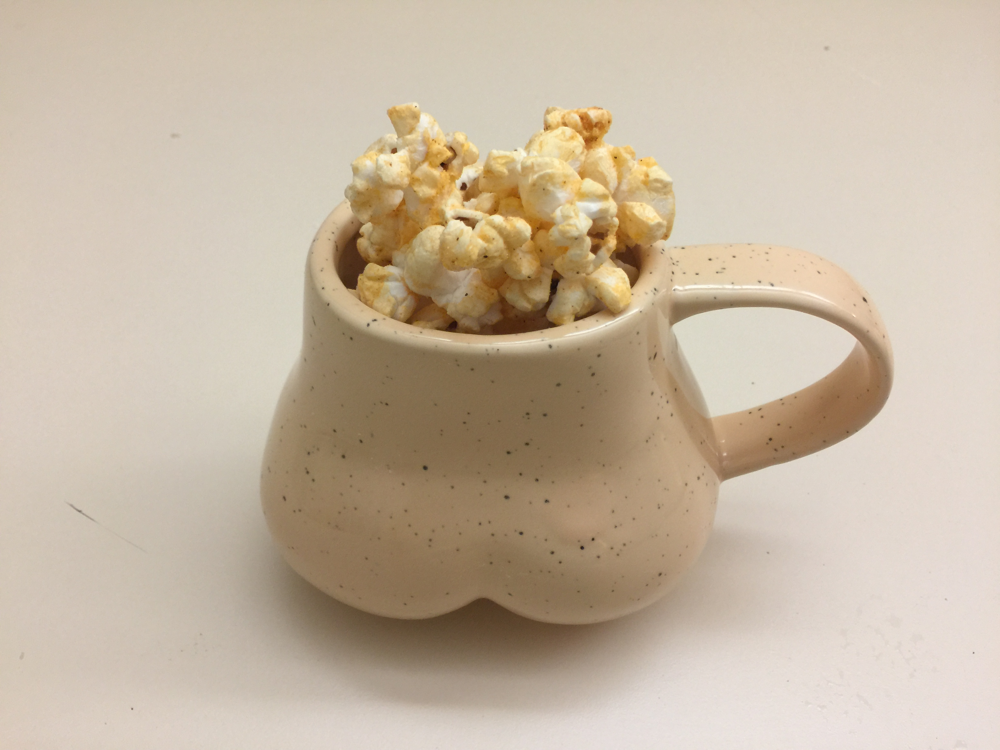
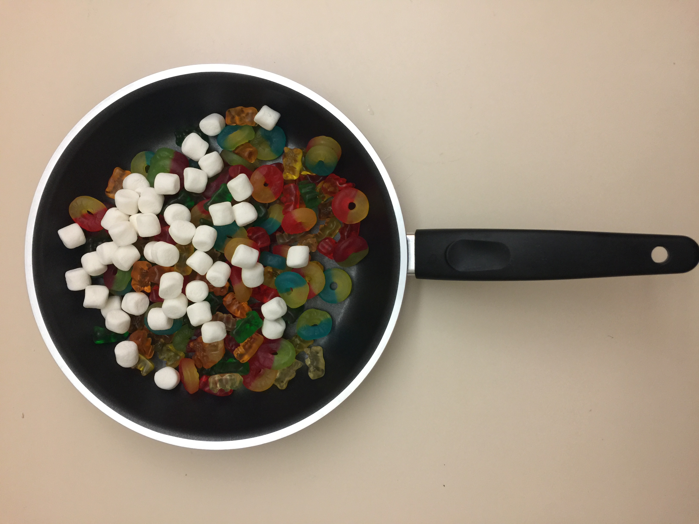
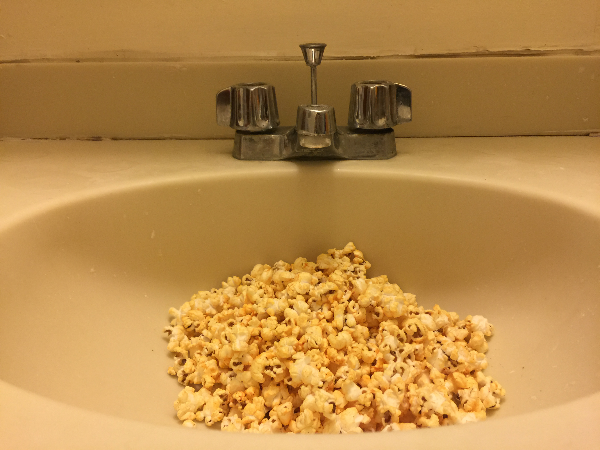
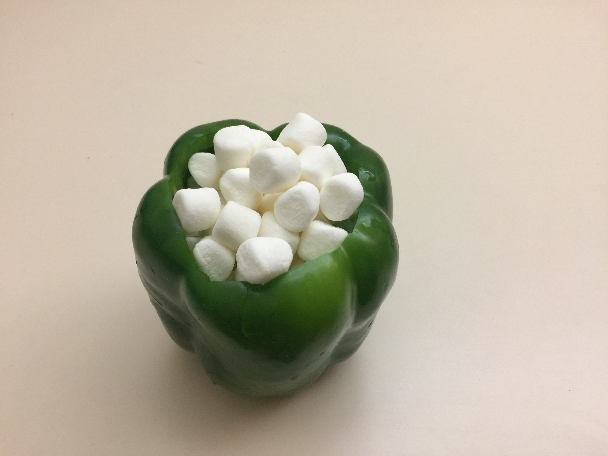
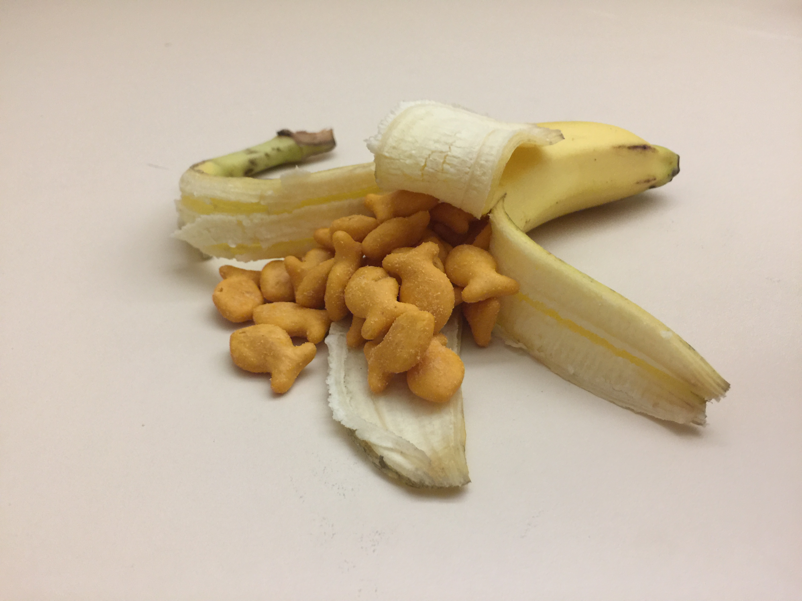
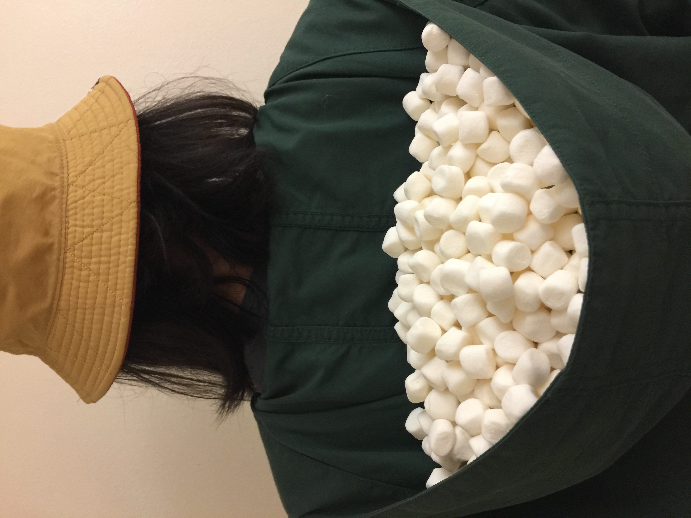

# Day 1 - Containers! --- Containers?

## Inspiration

I always wanted to do a project about snacks. I got a note the other day during our paper fight on class:

So I decided to incorporate these two ideas.

I bought Haribos, marshmallow, popcorn, and the concept is to put these snacks in places ('containers') that they should not have been under normal circunstances.

 a_flip = a[:, ::-1]
