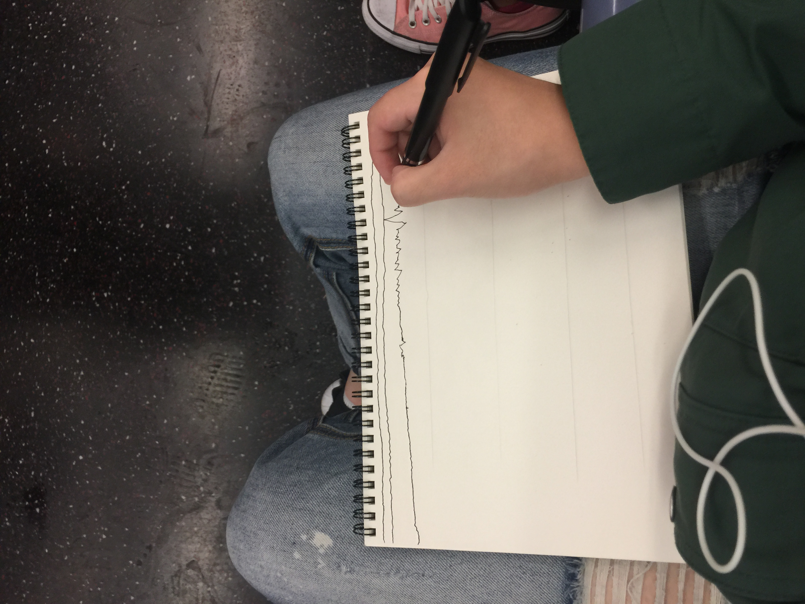
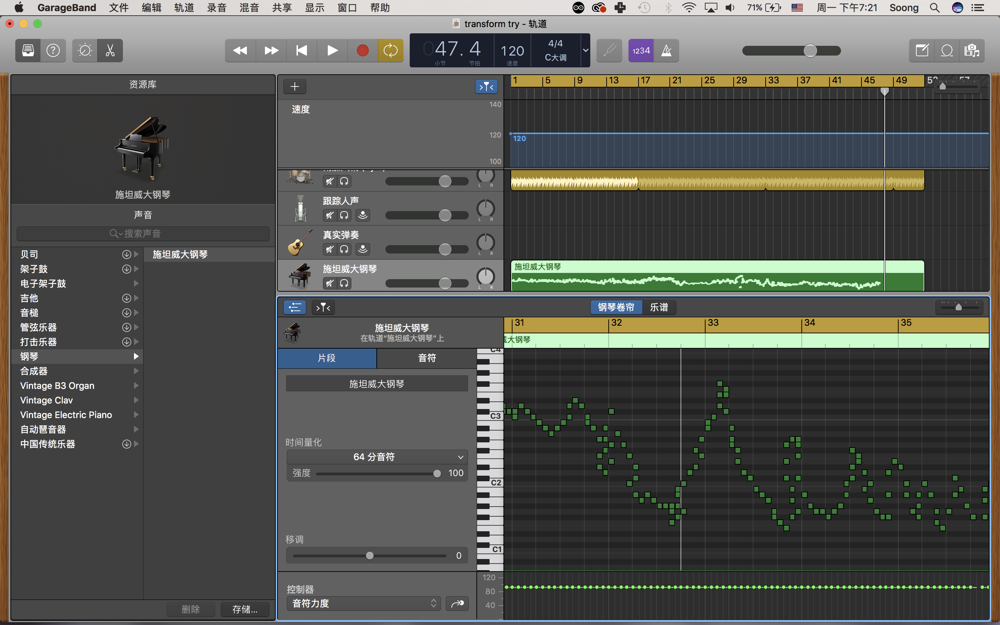

# Day 2 - What does a journey sound like?

## Inspiration

Orignally I wanted to draw out how a route could be like by using pen and paper to record the vibration of my body when commuting from place to place.
Then I realized the product will be very similar to frequency of sound.
Therefore, I thought it could be fun to try to convert it into something people can listen to and thus, to percieve the route in a different way.

## Idea

Try to draw straight lines while letting the hand move freely when there are movements when commuting.
i chose the route from my newly moved-in flat to the flat I temporarily stayed. 
The route is: walk —> subway —> walk

## Process
There were many interesting moments in the commute:
- it was rainy earlier that day so on the walking part I had to jump over a puddle which then produced a huge wave and you can here the sound pitch being really high in the audio below
- when I waited for traffic signal, the drawing was pretty much a straight line so it sounds very steady
- many people starred at me like I was a psychopath
- many people wanted to see what I was drawing but turned to be disappointed by my result - just chaotic waves

<iframe width="560" height="315" src="https://www.youtube.com/embed/7LBghwz0QOo" frameborder="0" allowfullscreen></iframe>

## Product

