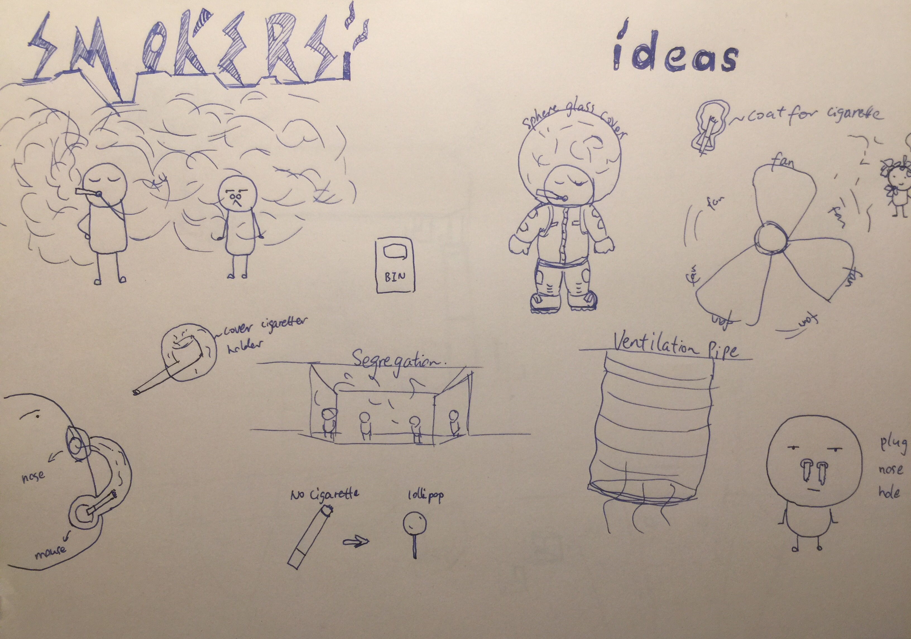
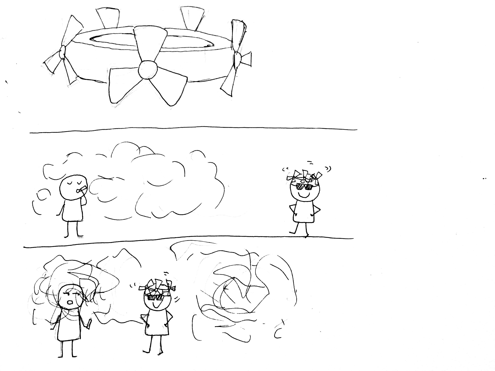
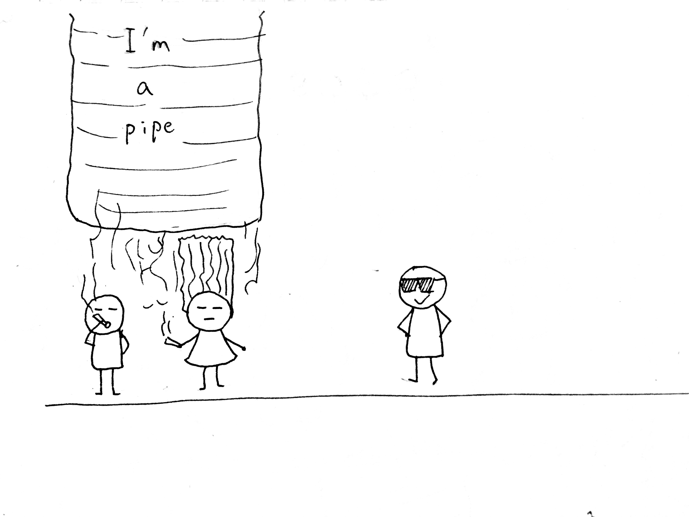
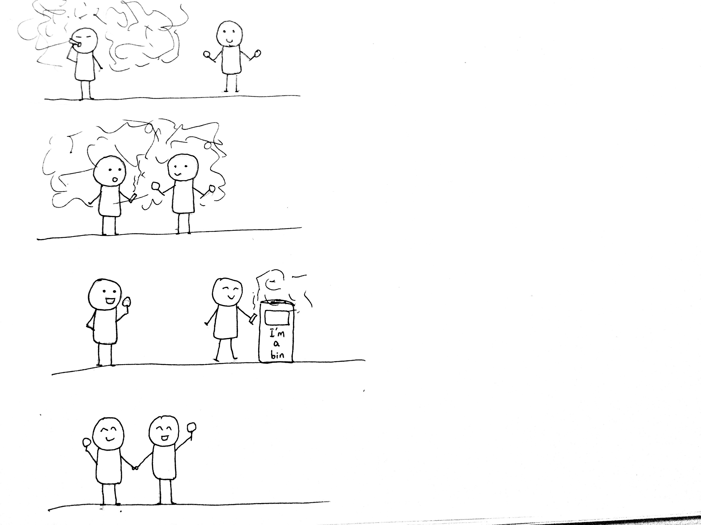

# Day 4 - Smoke

## Inspiration
Although I do not dislike people who smoke, I do hate it when the smoke floats towards me and I have to take in secondhand smoke.

## Idea
This project is for me to brainstorm ways that can prevend such situation so that people do not like smoke don't have to suck in secondhand smoke.
I used drawings to express my ideas. Although they are pretty simple.

I selected several ideas to make small comic to demonstrate the scenario.

------------------------------------------------------------------------------------------------------------------------------
Story 1
------------------------------------------------------------------------------------------------------------------------------

------------------------------------------------------------------------------------------------------------------------------
Story 2
------------------------------------------------------------------------------------------------------------------------------

------------------------------------------------------------------------------------------------------------------------------
Story 3
------------------------------------------------------------------------------------------------------------------------------

