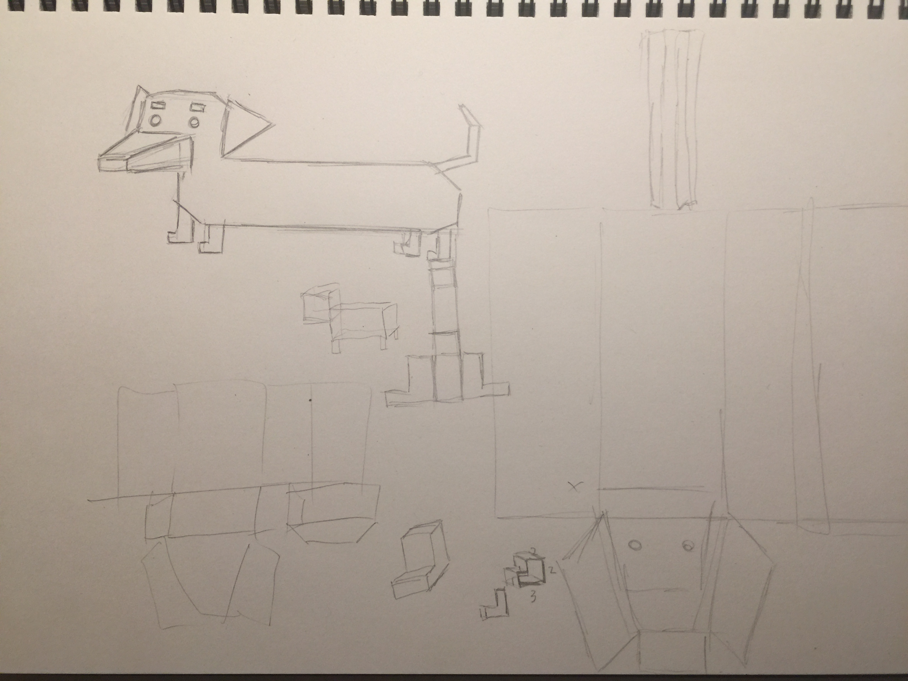
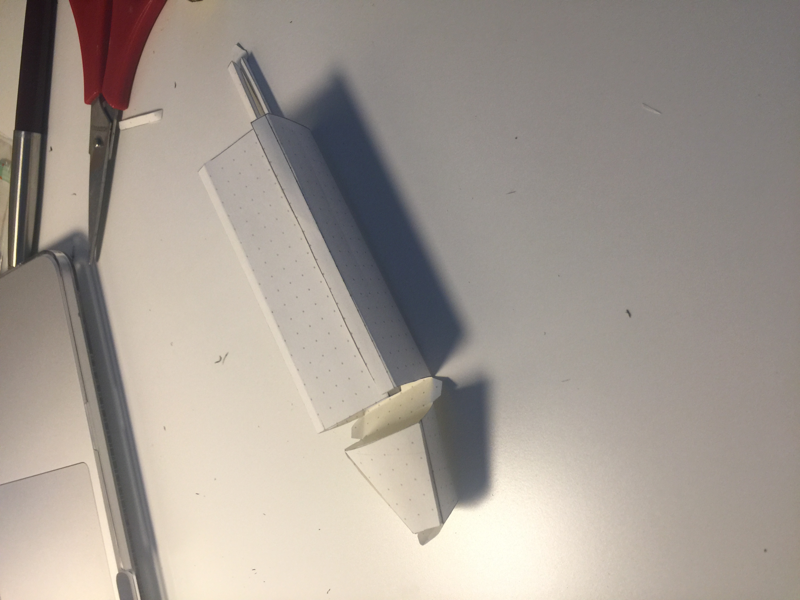
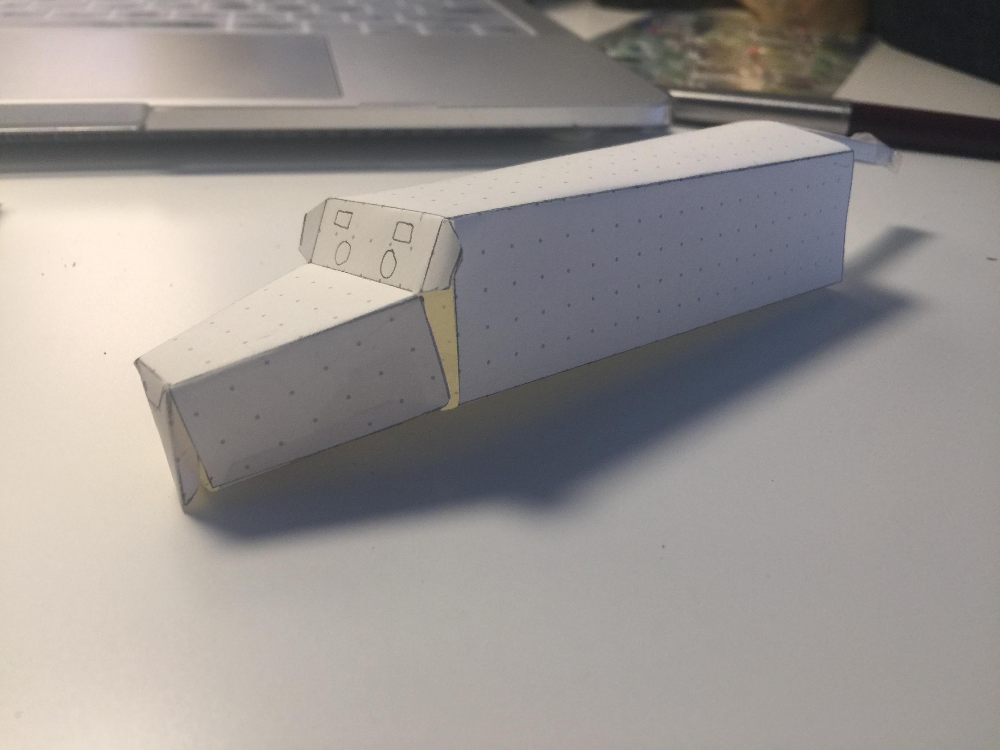
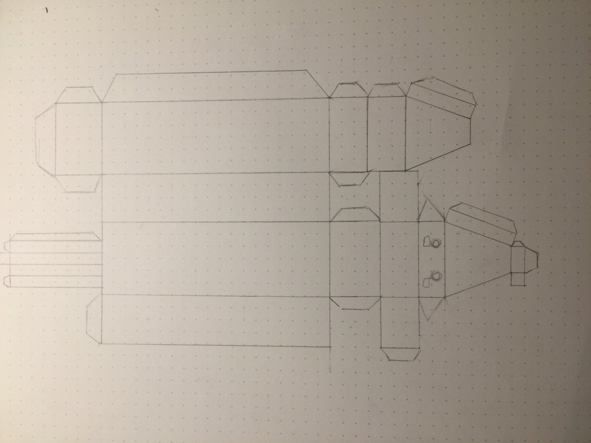
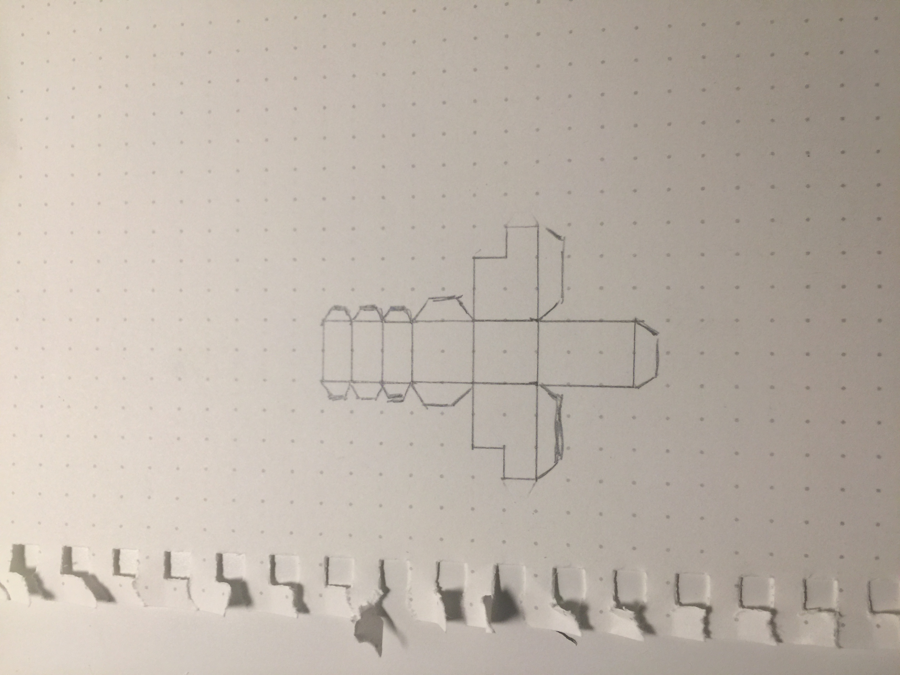
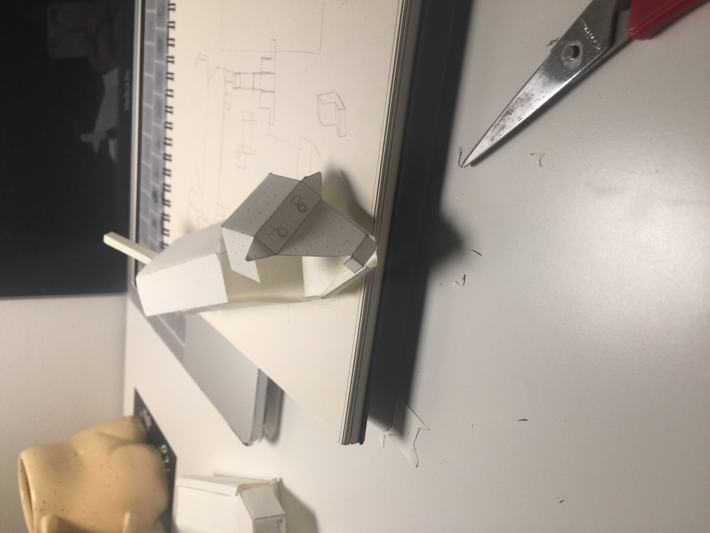
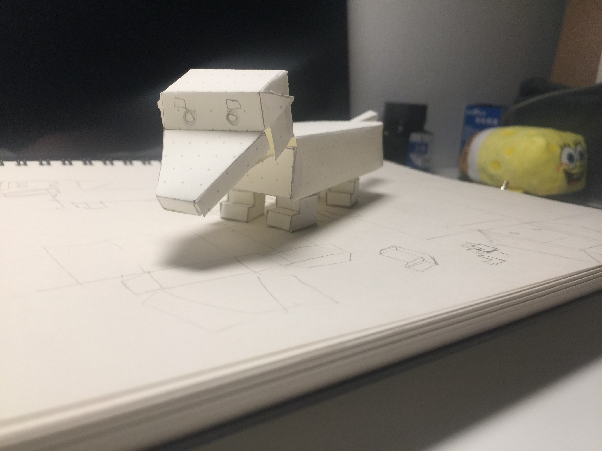
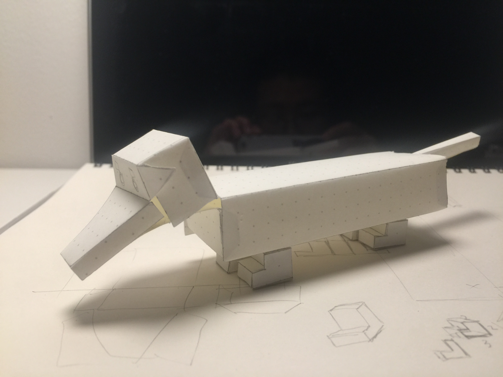
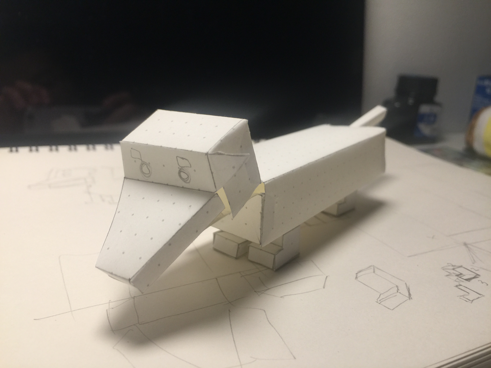

# Day 5 - I want a dachshund so I made one myself

## Inspiration
I am a big lover of dogs. 
Recently I realized myself falling in love with dachshund. 
I can watch vidoes of them all day on Instagram.
Why not making one for myself if I like them so much?
So I made one.

Paper is the material. I wanted to produce something like this:

I tried to design a plan for folding paper by myself and I failed once before successfully making a paper dachshund.

Prototype (failure) 1:

It looks like a mouse instead of a dog. The problem is that the head and the body shouldn't be on the same place horizontally, yet it took me sometime to realize this...

Prototype 2:

You can see that there are still small problems with the head of the dog yet I am pretty happy with the result.

It will be fun if I make this plan into digital one, color it, and print it with harder and thicker paper.
In addition, I would like to make this dachshund bark whenever I call him, maybe using arduino kit.
