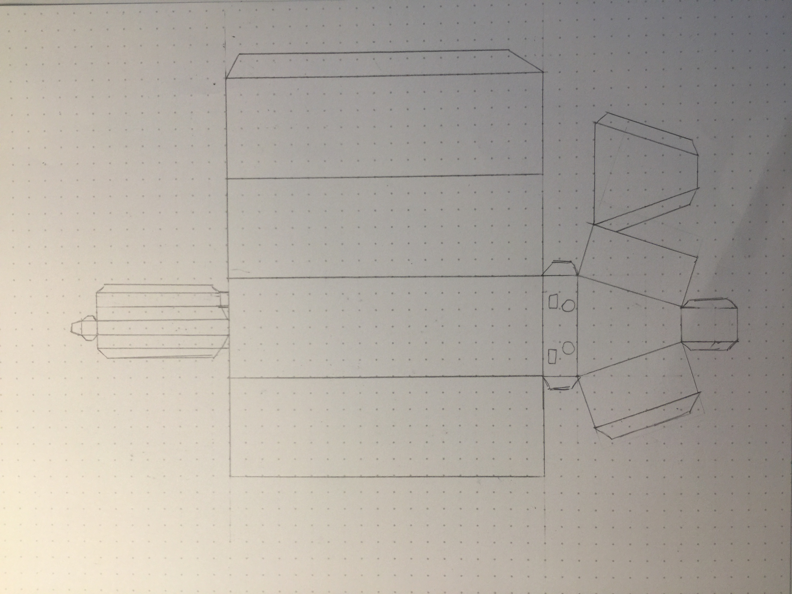
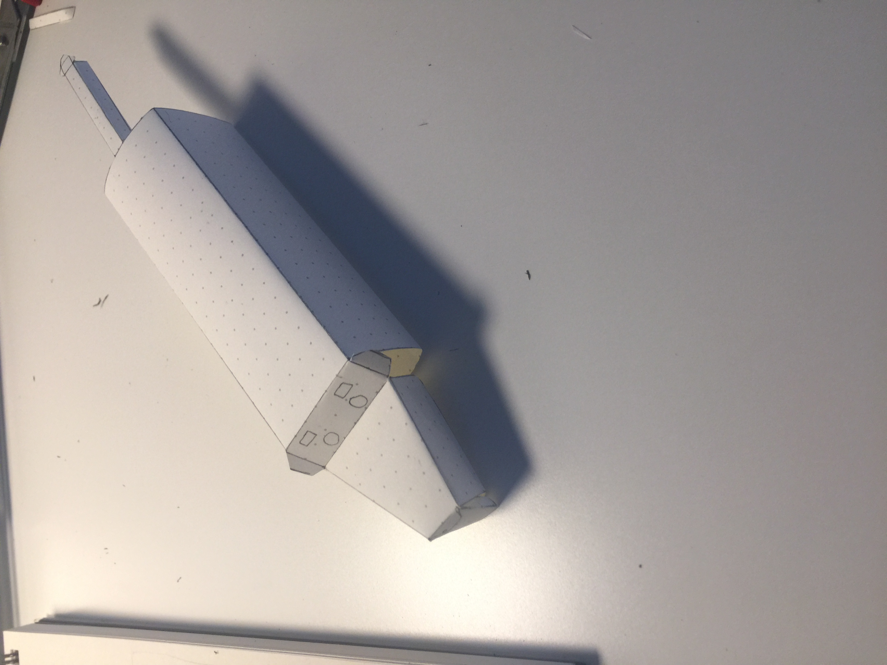

# Day 5 - I want a daschund so I made one myself

## Inspiration
I am a big lover of dogs. 
Recently I realized myself falling in love with daschund. 
I can watch vidoes of them all day on Instagram.
Why not making one for myself if I like them so much?
So I made one.

Paper is the material and I did several prototypes (failures) before successfully making to the final daschund.

Prototype (failure) 1:

As you can see the head and the body shouldn't look like this. But it took me sometime to realize this problem.

Prototype (failure) 2:

