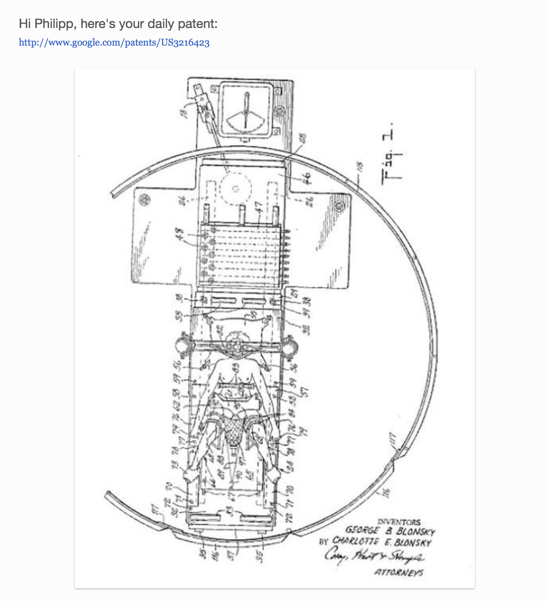

# 5 in 5

I disregarded most rule suggestions from the post-it notes because they were concerned with using only certain colors and generally the visual outcome of a project. For my MFA I am not very interested in these aesthetics (although they're of course part of anything I make), but care more about developing good ideas and developing my practice as a designer/artist.  

With this in mind I thought that I could make my 5-in-5 about creating tools to cultivate ideas.

## 8/30: Daily Patent
In what I'd call my existing artistic practice, I am generally interested in the social and political remifications of technology and design. Especially upcoming technologies provide inspiration for projects. To increase my exposure to these inspirations, I wanted to create an automated newsletter that sends me one interesting patent a day.  

Google used to have a Patents API, but has deprecated the endpoint in 2011. So I tried scraping patents from Google Patents using a simple Python script: 

```python
// import libraries
from lxml import html
import requests
// search for patents
page = requests.get('https://patents.google.com/?q=AI&scholar')
tree = html.fromstring(page.content)
// join all the HTML to a single string
text = tree.xpath("//text()")
text = ' '.join(str(x) for x in text)
// apply a regular expression to filter for patent URLs
regexpNS = "http://exslt.org/regular-expressions"
find = tree.xpath("//*[re:test(., '\/patent\/.*\/en', 'i')]", namespaces={'re':regexpNS})
// show the results
print(find(text)[0].text)
```
I am not a Python expert just yet, but am under the impression that Google has built into their page some measures to hide some of the HTML from robots like my scraper. At least the HTML my script returns does not include the list of patents from the website.  

Since I didn't want to put in more time troubleshooting this first step of the project, I decided to prototype it manually. I selected a few intriguing patents from a Tumblr blog called [googlepatents](http://googlepatents.tumblr.com) and set up a [TinyLetter](http://tinyletter.com) newsletter to send me an email with a patent once a day.

I kept the emails pretty basic, only including the name, url and patent illustration. Here's how they look like:

### Fetus Snowglobe




If I had more time to complete this project, I'd try to automate the patent scraping, mail setup and delivery. Another step could be to randomize the query, for example by taking a query term from the news, a random list of verbs or the previous day's patent.


# 5 in 5
[Project brief](https://docs.google.com/a/newschool.edu/document/d/1LOWQXv9i27Uj8eECxLeZi66yjTRcqk260O4kw_98eOc/edit?usp=sharing)

## Assignment guidelines
* For the next five days, create one project per day. Each project must be conceptualized, produced and documented in a single day. 
* The more experimental the better.
* Usage of skills learned in other classes is encouraged.
* Monday is Labor Day (no class) but post a link with documentation of your work on Github by EOD on Monday

## Presentation guidelines
* On Wednesday, 9/6
* 7 minutes presentation each person
* 30 minutes group discussion afterwards

## Questions
* What are some rules you put in place for your project?
* What is the relationship between concept and execution?
* Is there something that ties the projects together?
* How could you have improved them?
* Did you enjoy the exercise, why or why not? What were some struggles?

## Examples
[Noah takes a photo of himself every day for 12.5 years](https://www.youtube.com/watch?v=iPPzXlMdi7o)

[Beeple](http://www.beeple-crap.com/everydays_one.php)

[NaNoGenMo](https://nanogenmo.github.io/)
